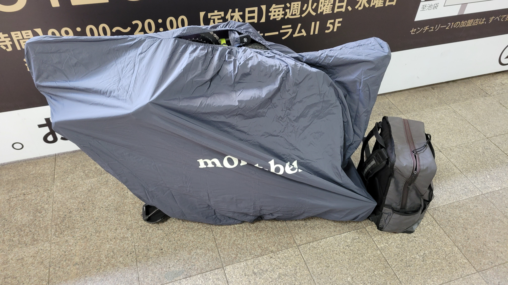
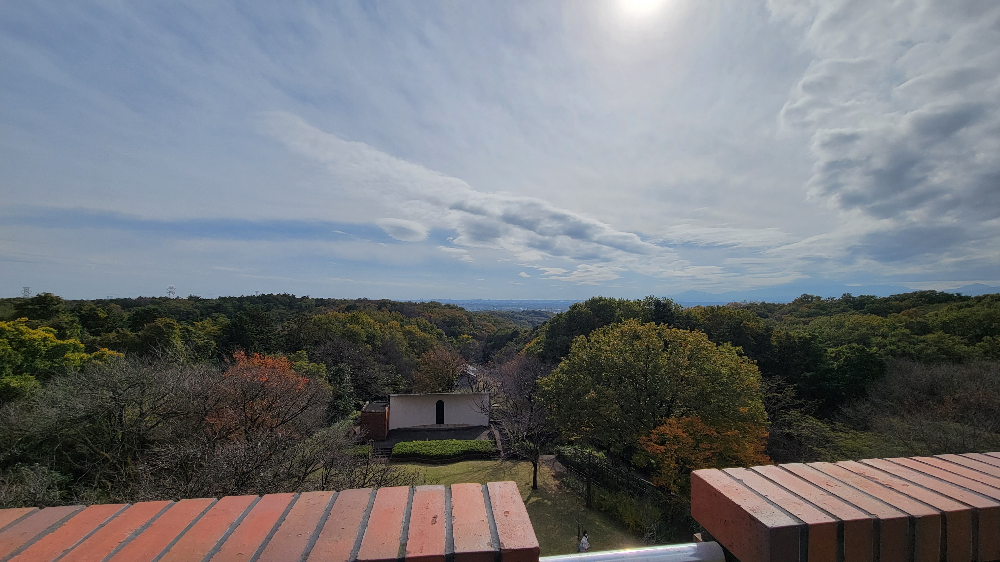
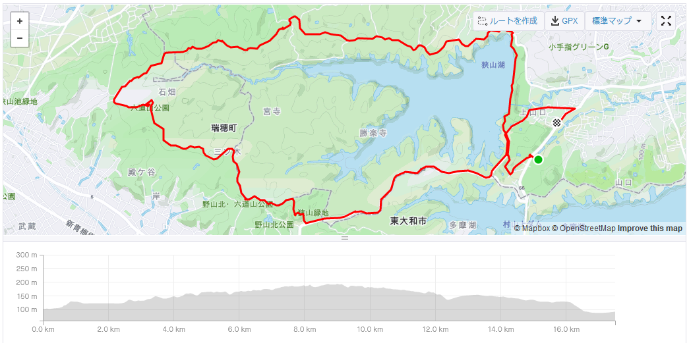

狭山湖畔の未舗装地を走ってきたので日記。狭山湖の正式名称は山口貯水池だそう。

## 装備

- JAMIS RENEGADE S3
  - Continental Terra Speed 40c
- モンベル コンパクトリンコウバッグ
- オーストリッチのディスクブレーキスペーサー

以上。

朝走り出したときは寒かったんですが、動くと暑かった。カジュアルウェアの限界を感じたけど、ぴちぴちだと頑張って漕ぎたくなってしまうので...

## 行動記録

自転車復帰してから間もないため、自宅から全部自走するとハンガーノック気味になりかねないので (1か月前に経験済み) 、狭山湖最寄りの西武球場前駅まで 1 本で行ける練馬駅まで自走、西武球場前駅まで輪行のスタイルをとった。

公園？内の遊歩道を走ったのですが、道が狭い + 歩行者が多いので微妙。次行くなら外周から行く。

湖を左に見ながら道なりに進んでいけば、そのうち狭山湖外周道路に入れる。

大したアップダウンではないんですが、2 年間運動をさぼった僕にとってはそれなりにこたえるものがあり、多摩湖のほうまで回らず、狭山湖外周だけ回って帰ってきた。輪行してよかった～。

ここで自己満足の写真を透過。10 月中旬でしたが、紅葉はいまいち。

40c のおかげか、砂利道くらいでは滑る気がしなかった。チューブレス化するともっと柔らかい乗り心地になるのかな。

ランチは肉うどんにする予定だったのですが、探すのが面倒だったので[たまたま見つけたカフェっぽいところ](https://cafe-garden-threeleaf.com/)で。庭でモルモットを飼っていて、モルモットを眺めながらカレーを食べた。

<table>
  <tr>
    <td></td>
    <td></td>
  </tr>
</table>

Strava のログはこんな感じ (どういうわけか共有リンクが使えないので画像で)。

20km 近く走った気はあんまりしなかったな。週末は MTB トレイル行ってみるつもり。行けるのかな、これで。
