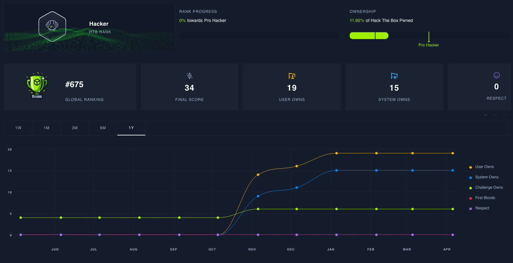
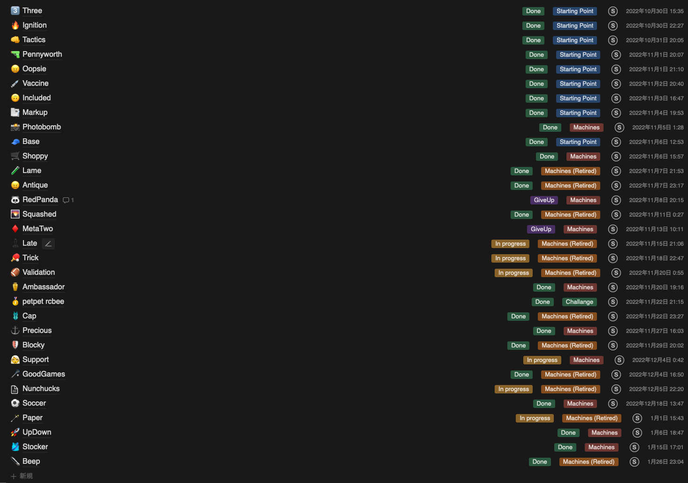

Hack The Boxを始めてからとりあえずの目標にしていた[Hackerランクに（3ヶ月ほど前に）到達した](https://twitter.com/shiomiyan/status/16128302030589829150)ので、やったこととか感想などを忘れないうちに（3ヶ月立ってしまったが）まとめてみる。

## 元の状態

- sqlmapとかnmapとか、名前くらいは知ってる
- SQLインジェクションなど、ある程度有名な脆弱性についてはなんとなく知ってる
- Linuxコマンド群は調べながらであれば多少使える
- CTF4Bとかは記念参加してた
- webアプリは書けません

## やったこと

だいたい時系列順。解いてた問題とかはHTBのプロフィールを参照。

https://app.hackthebox.com/profile/activity/260593

### 2週間くらい

とりあえずStarting Pointを全部埋めてた。

「侵入するって一体何すれば...」という状態だったので、Starting Pointの中でもいくつか詰まったものもあった。

とはいえステップを踏んで回答を埋めていく形式なので、案外すぐ（？）解けてた。

Walkthroughが用意されているが、自分が何をしたかをまとめる意味で、少しでも作業したものは非公開のNotionに解法をまとめたりしてた。

### 半月くらい

Ratingの高いRetiredになったマシンを中心に取り組んでた。

なるべくWriteupを見ないでやりたかったので、平気で1問10時間とか、試行錯誤しながらやってた。

コマンドの意味すらすぐ忘れるので、とりあえず何かしらの問題に（ほぼ）毎日取り組んでた（気がする）。

ここでも解いた問題はすべて自己流Writeupを書いてた。

多分6個くらい解いてた。今思うと案外少ないな〜という気持ち。

### 半月くらい

いくら解いてもPointがもらえないことのフラストレーションが溜まりまくってActive Machineを解き始めた。

たぶん最初に解けたのはPhotobompかShoppyあたり。多分2日とか悩み続けて解いてた。

基本、各Machineのフォーラム、[PyloadAllTheThings](https://github.com/swisskyrepo/PayloadsAllTheThings)、[HackTricks](https://book.hacktricks.xyz/welcome/readme)、[たまたま見つけたチートシート](https://ed4m4s.blog/)あたりを参考に解いてた。フォーラムは出たてほやほやのMachineだと、結構直接的なことが書かれてたりしたので「おっと...」となることはちょいちょいあった。ので、途中からあまり見なくなった。

この間もRetiredに取り組んでいたが、userフラグへの手がかりは割と見つけられるようになっていて、rootフラグ取得のための権限昇格まわりでムムム...となることがほとんどって感じだった。

### 2ヶ月くらい

↑とやってることはほぼ同じ。基本はEasyなMachineが新しく出るのを待ちながら、Retiredに取り組んでいた。

Mediumはあまり手を付けてこなかったが、ここあたりでRetiredなら物によってはuserフラグくらいは取れることに気づいて、とりあえずuserフラグだけ取りに行ったりしてた。

Activeで初挑戦したMediumがたぶんAmbassadorで、取れそうで取れないrootフラグがあって死ぬほど苦戦して（多分3日くらいかけて解いた）、初めてMediumのrootフラグをとった気がする。

### それ以降

出たら解くを繰り返して、Hackerランクに到達した。

しばらく習慣的に取り組んでいたが、別のことにお熱になってしまったので3ヶ月くらいただお布施してる人になってる。

## 所感

おそらくだいたい3ヶ月くらいかけてHackerに到達した。

- ツールの使い方がわかってきた
- どんなシナリオでサーバー内に侵入するかの一連のフローがイメージできてきた
- なんとなく怪しそうな部分に当たりがつけられるようになってきた

あたりに成長は感じてる。

思い返して意識していたであろうことは

- 用途に合わせたツールの使い方を知る
  - そのツールが何をしてくれるのか、その情報から何がわかるのか
  - （あんまり関係ないですが、モダンツール調べまくってしまう質なので、feroxbusterやrustscanあたりを愛用してた）
- Enumerationを徹底する
  - Directory Listing系はワードリストが大事かもしれない...
- 見かけないヘッダや設定値、ツールが使われているならそれが何をするものなのか、よく調べる
- ライブラリ、ミドルウェア等のバージョンがわかっているなら、CVEを使う線は必ず考慮する
- ど根性

たぶんこのへん。

要約すると執念とど根性で得たHackerランクでした。