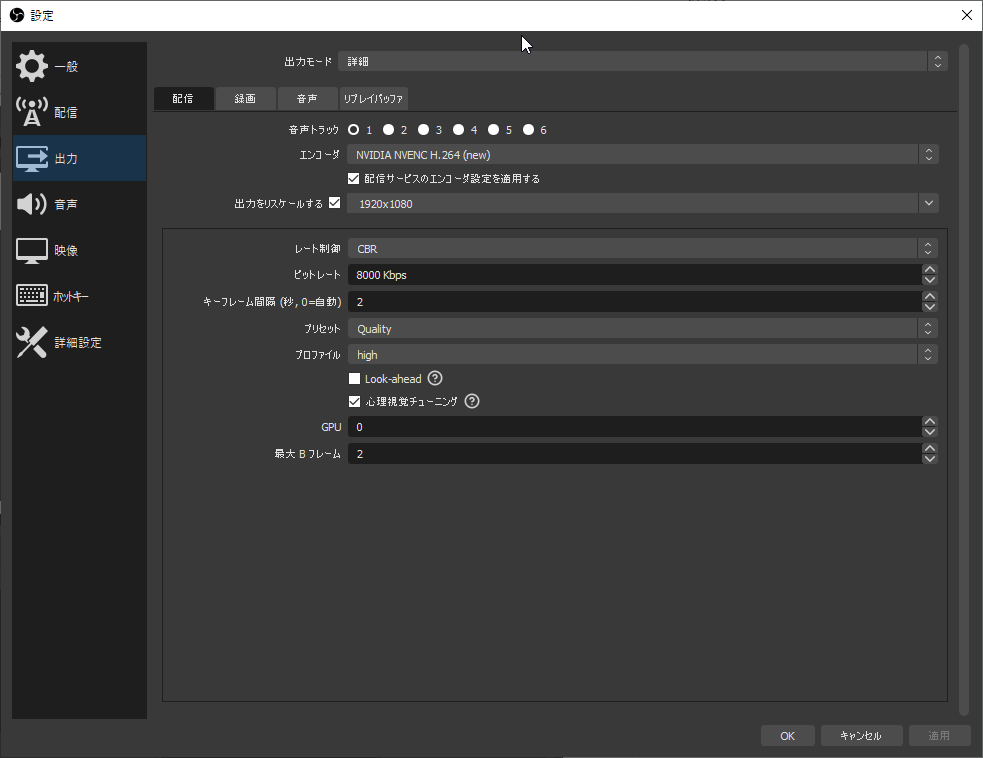
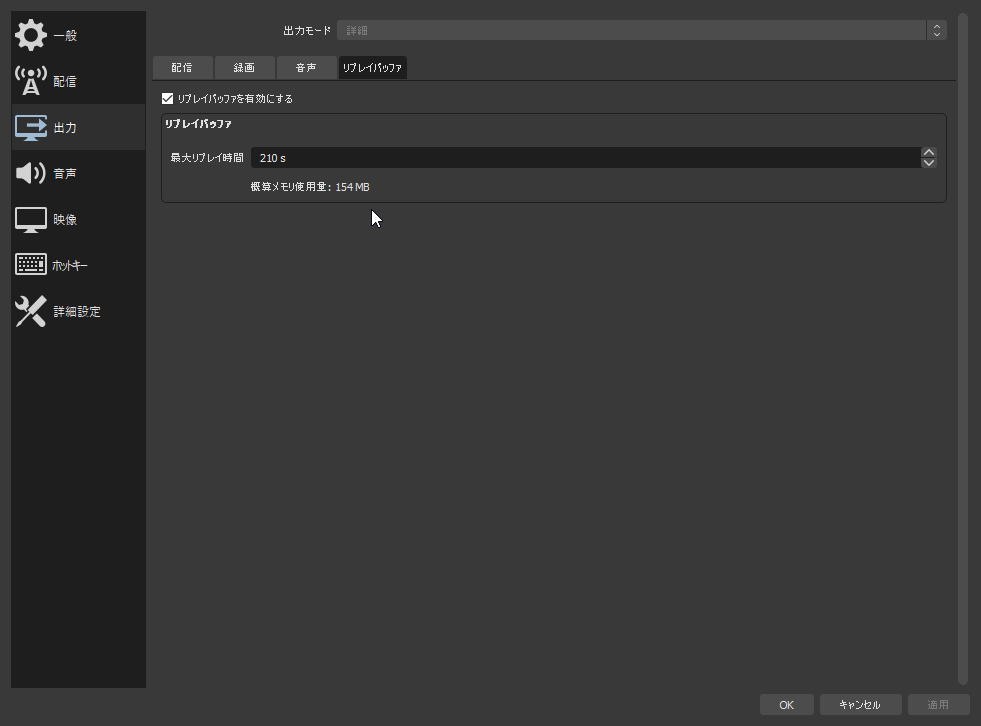
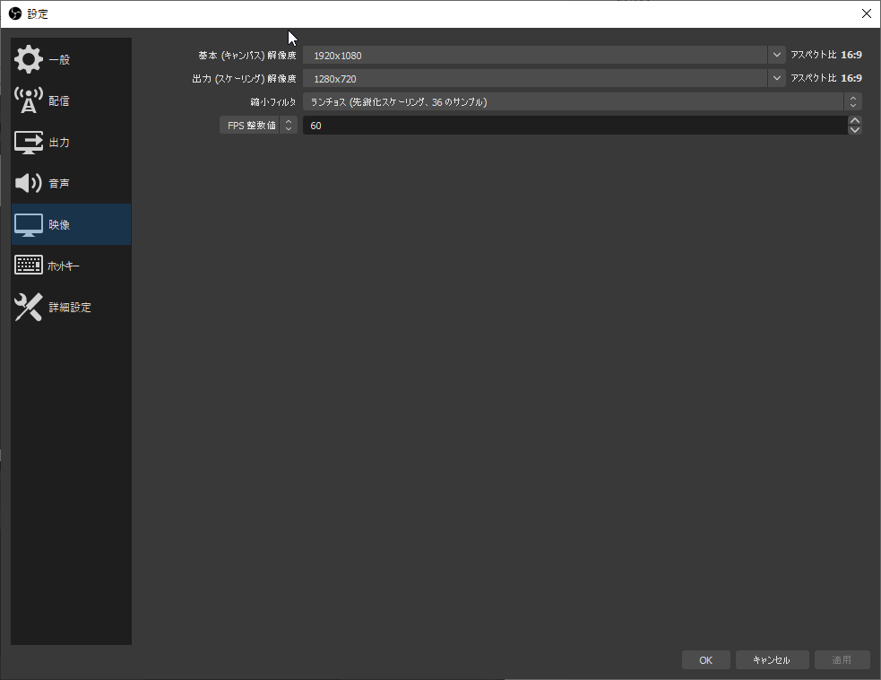
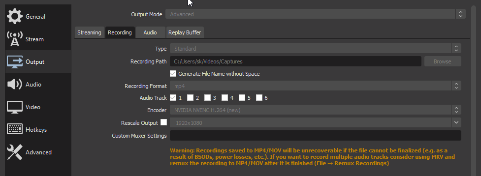
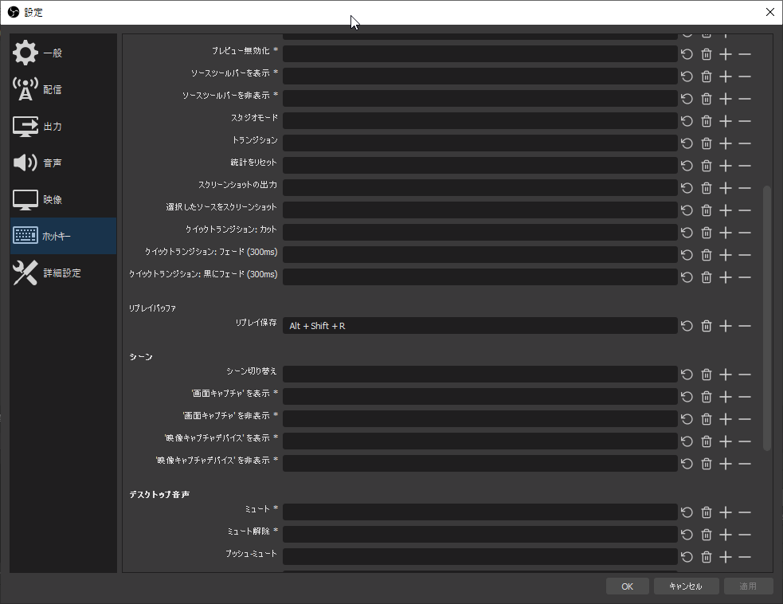
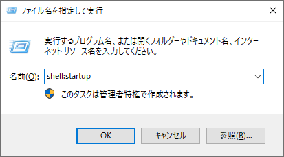
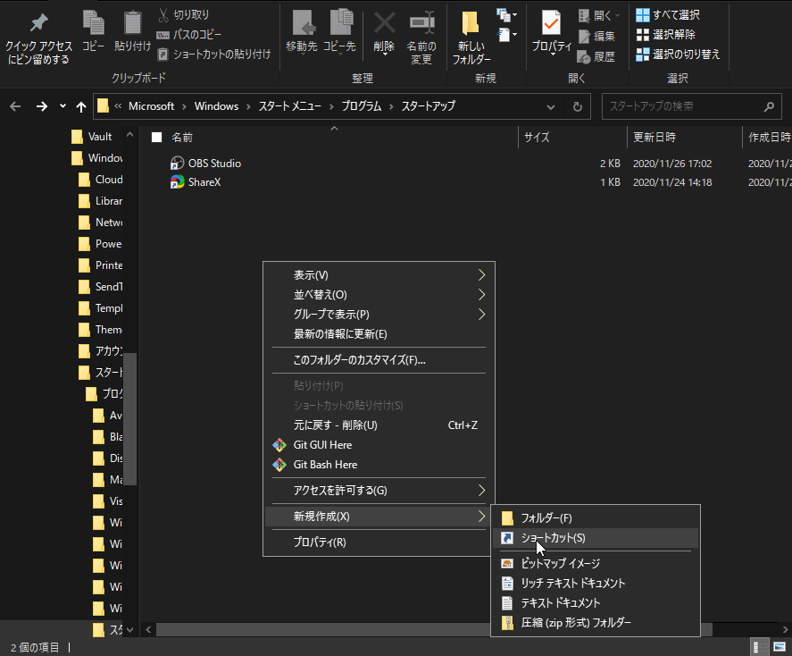
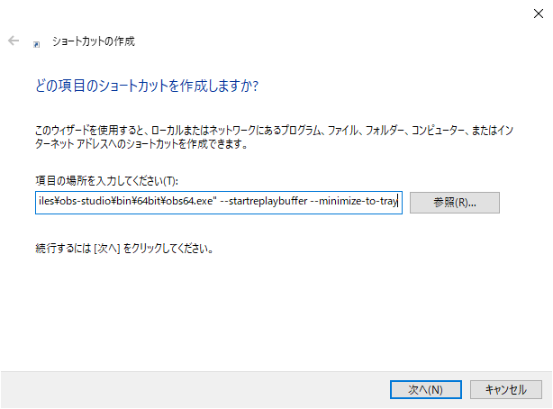

OBS Replay Buffer を Geforce Experience の instant replay のように使う方法。

## OBS のインストール



普通にインストールすればよい。

## OBS の設定

### エンコード設定

PC スペック、用途に合わせてエンコード設定する。

出力 > 録画タブのエンコーダーに "ストリームエンコーダーを使用" を設定している場合、リプレイバッファにもこれが適応される。

その際のビットレートなどに関しては以下を参照するとよい。





新たにエンコーダ設定を定義すればその設定が適応されるので、適宜設定する。

今どきのパソコンを使っていれば、ビットレート 8000 ~ 1200 Kbps あたりにしておけばちょうどいい気がする。



最大リプレイ時間が増えれば、それに比例してメモリの使用量も増えるので、自分のスペックと相談しつつ、必要最低限に設定する。





### 保存先の設定

出力 > 録画 > 録画ファイルのパスを保存したいところに適宜設定 (例: `C:\Users\<username>\Videos\Captures`)



### ホットキーの設定

リプレイを保存ために一々 OBS を触っていては流石に面倒なので、任意のホットキーを設定する。リプレイバッファをオンにしていれば、設定のホットキーの項目にリプレイバッファの項目が見えている。



## ログオン時に OBS を自動起動させる

いちいち手動で起動させなくて済むので、やっておくと便利。

<kbd>Win</kbd> + <kbd>R</kbd> から、`shell:startup` を入力し OK。



右クリック > 新規作成 > ショートカットから、ショートカットを作成する。



項目の場所に `"C:\Program Files\obs-studio\bin\64bit\obs64.exe" --startreplaybuffer --minimize-to-tray` を指定。次へを押して、任意の名前 (OBS Studio 等) を設定後、完了。



余談ですが、自分は起動パラメータを以下のように設定しています。
```
--startreplaybuffer --minimize-to-tray --collection "default" --profile "default" --scene "replay"
```

こうしておくことで、プロファイルとシーンコレクション、シーンを明示的に指定できるため、気持ち安心できます。




さらに、 OBS の設定 > 一般 > システムトレイのチェックボックスをすべてチェックする。

最後に、PC を再起動して OBS Replay Buffer が走っていることを確認して終了。

Geforce Experience と比べた際のよさそうな点として、ゲーム上にオーバーレイを重ならない点があげられそう。Steam のオーバーレイと同様、多少なりとも重くなる気がするので。

また劣っていると感じる点はゲームごとのフォルダリングができない点。プラグインで何とかできそうっちゃできそうではあるけど。

---

Edit log
- 2022/04/11
- 2021/09/21