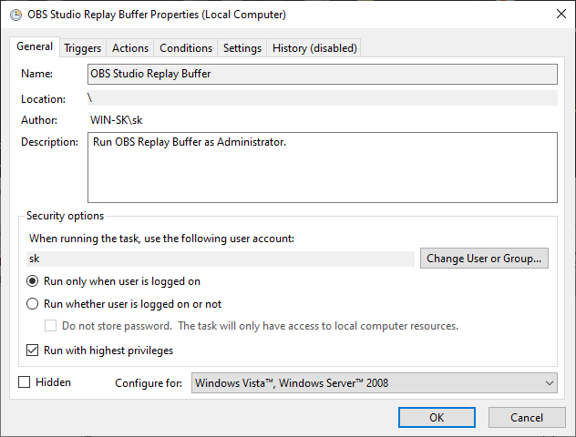
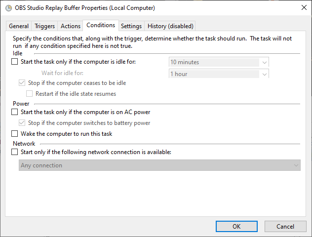
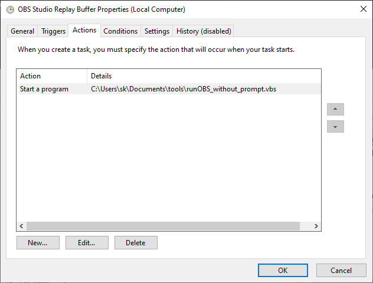
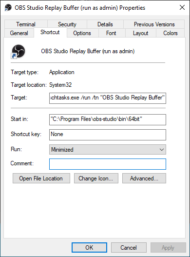

## 背景

管理者で起動されたアプリケーション上で、OBS リプレイバッファのホットキーを動かしたかった。

`shell:startup` スタートアップにあるショートカットのプロパティをいじるだけでは、起動時に毎回 UAC が出てきてうざいので、それを回避できる方法がほしかった。

## 手順

普通にショートカットを作るだけでは UAC が出てしまうので、タスクスケジューラーを介して、高い権限で実行させる。

ユーザーディレクトリ配下にスクリプトを配置しているため、パスを表現する際に `<username>` を使っているので、適宜置き換える。

ちなみに、以下記事を参考にした。





### スクリプト作成

OBS を起動するバッチファイルと、それをプロンプトなしで実行させる Visual Basic スクリプトを作成する。

任意のディレクトリ（今回は `C:\Users\<username>\Documents\tools`）に以下 2 つのファイルを作成。

- runOBS.bat
- runOBS_without_prompt.vbs

内容は次のように記述。

runOBS.bat

```bat
start /d "C:\Program Files\obs-studio\bin\64bit\" obs64.exe --startreplaybuffer --minimize-to-tray --collection "default" --profile "default" --scene "replay"
```

runOBS_without_prompt.vbs

```vbs
Set ws = CreateObject("Wscript.Shell")
ws.run "cmd /c C:\Users\<username>\Documents\tools\runOBS.bat", vbhide
```

バッチファイルのみで再帰的に呼び出すことで実現できるようですが、試していません。

### タスクスケジューラーに登録

Win + R から、`taskschd.msc` を実行。

タスクスケジューラーライブラリ右側の Create Task を押下。

タスク名を `OBS Studio Replay Buffer` に設定（適宜変更可能だが、後で使うのでそのつもりで）。

General タブの Security Options にある「Run with highest privileges」にチェックを入れる。



さらに、Conditions タブの Power 下のチェックボックスをすべてアンチェック。



最後に、Actions タブから New を押下しアクションを新規作成し、以下のように設定。

- Action: Start a Program
- Settings
  - Program/script: `C:\Users\<username>\Documents\tools\runOBS_without_prompt.vbs`



トリガー等は特に設定の必要がないので、このまま OK を押下。

### ショートカットの登録

Win + R から、`shell:startup` を起動。

右クリックメニューからショートカットを作成、実行ファイルの場所に以下を指定。

```
C:\Windows\System32\schtasks.exe /run /tn "OBS Studio Replay Buffer"
```

ショートカット名にはわかりやすそうな名前を適宜つける。Finish を押下。

続いて、作成されたショートカットを右クリックしプロパティを開き、Run を Minimized に変更。



最後に、タスクマネージャーから作成したショートカットがスタートアップ中にあり有効となっているかを確認する。

PC を再起動し、OBS の実行を確認できれば完了。

---

快適～。さようなら UAC。
