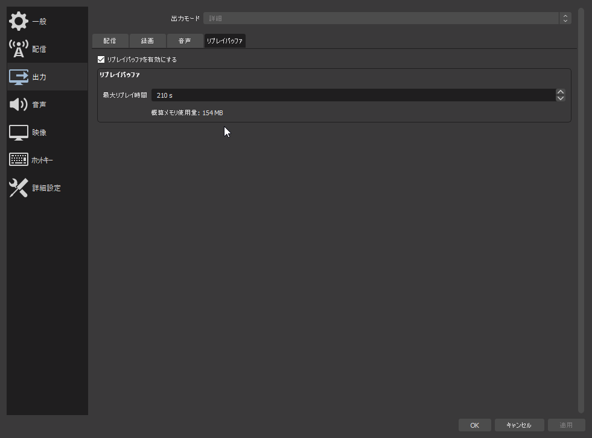
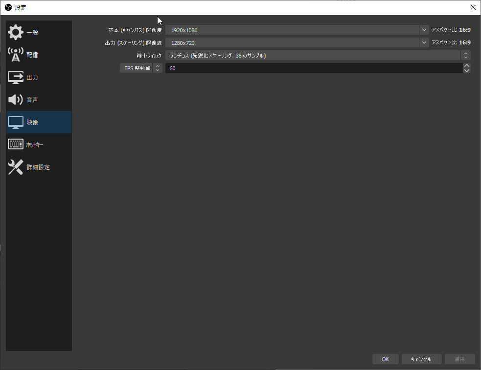
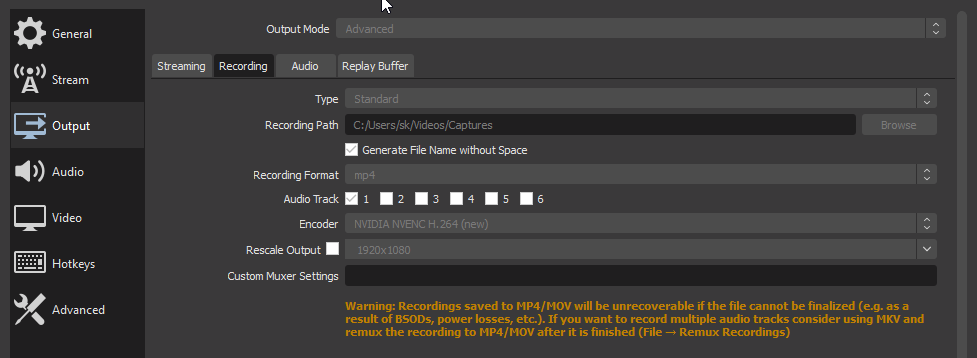
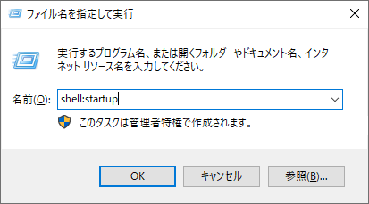
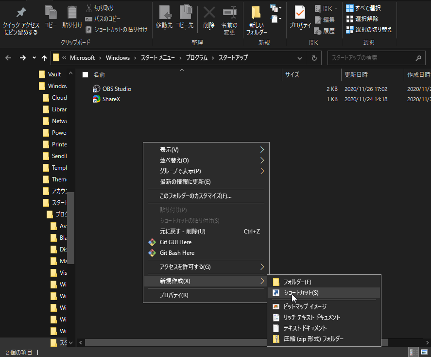
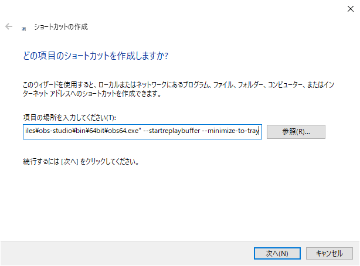

OBS Replay Buffer を Geforce Experience の instant replay のように使う方法。

## OBS のインストール



インストール先のディレクトリを変更していないことを前提に話を進める。

## OBS の設定

基本的な OBS の設定にも触れておく。

### エンコード設定

PC スペック、用途に合わせてエンコード設定する。

ビットレートの設定は適宜アップロード先の推奨ビットレートを参考にして設定。





NVENC で動きの早いゲームや色味の強いゲームを録画する際は、 ビットレートをやや多めに設定しておくときれいに取れる。

### 保存先の設定

出力 > 録画 > 録画ファイルのパスを保存したいところに適宜設定 (例: `C:\Users\<username>\Videos\Captures`)

### ホットキーの設定

リプレイを保存ために一々 OBS を触っていては流石に面倒なので、任意のホットキーを設定する。リプレイバッファをオンにしていれば、設定のホットキーの項目にリプレイバッファの項目が見えている。

## ログオン時に OBS を自動起動させる

いちいち手動で起動させなくて済むので、やっておくと便利。

<kbd>Win</kbd> + <kbd>R</kbd> から、`shell:startup` を入力し OK。

右クリック > 新規作成 > ショートカットから、シートカットを作成する。

項目の場所に `"C:\Program Files\obs-studio\bin\64bit\obs64.exe" --startreplaybuffer --minimize-to-tray` を指定。次へを押して、任意の名前 (OBS Studio 等) を設定後、完了。

余談ですが、自分は起動パラメータに `--startreplaybuffer --minimize-to-tray --collection "default" --profile "default" --scene "replay"` として、プロファイルとシーンコレクション、シーンを明示的に指定してます。



さらに、 OBS の設定 > 一般 > システムトレイのチェックボックスをすべてチェックする。

最後に、PC を再起動して OBS Replay Buffer が走っていることを確認して終了。

Geforce Experience と比べた際のよさそうな点として、ゲーム上にオーバーレイを重ねる必要がない点があげられそう。Steam のオーバーレイと同様、多少なりとも重くなる気がするので。

また劣っていると感じる点はゲームごとのフォルダリングができない点。プラグインで何とかできそうっちゃできそうではあるけど。

---

- 2021/09/21 記事を修正
