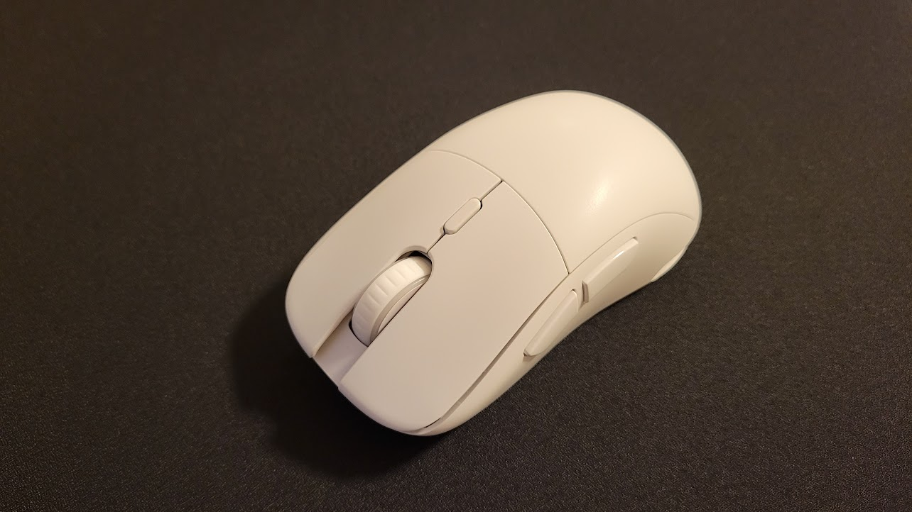

買いました。

qoo10 で注文して、だいたい 1 週間ちょいくらいで届いた。



2 年近く ZOWIE S2 を使っていて、形も好きだったので S2 クローンでワイヤレスを使ってみたかった。

結論から言うと、TITAN GX AIR は結局使わずに S2 使ってます。

スペック等細かいところは以下。

- [「Xenics TITAN GX AIR Wireless」レビュー。コストパフォーマンスに優れたS2クローンのワイヤレスマウス | DPQP](https://dpqp.jp/review/xenics-titan-gx-air-wireless)
- [XENICS、PAW3370採用で重量78gのワイヤレスゲーミングマウス『TITAN GX AIR WIRELESS』 - ヲチモノ](https://watchmono.com/e/xenics-titan-gx-air-wireless)

## ちょっと使った感想

すべて ZOWIE S2 との比較。

### Pros

- マウスホイールが軽快
  - S2 で感じてた若干軋む感じがない
- 軽い
  - ソールが違うこともあるが、感度が 1.5 倍くらいに感じてる
- ビルドクオリティ ⭕

### Cons

単に自分には合わないだけなことも。

- ソールの粘着力が甘い

- 重心位置が若干後ろ...？
  - バッテリーが後ろ寄りだからなのか、そもそも筐体が軽いからか、S2 はケーブルのおかげで気にならなかったのか、軽く握ると尻が落ちる
- クリック固め
  - 思った以上に固かった

という感じで、ちょっと許容できそうになかったので使うのを一旦保留してます。