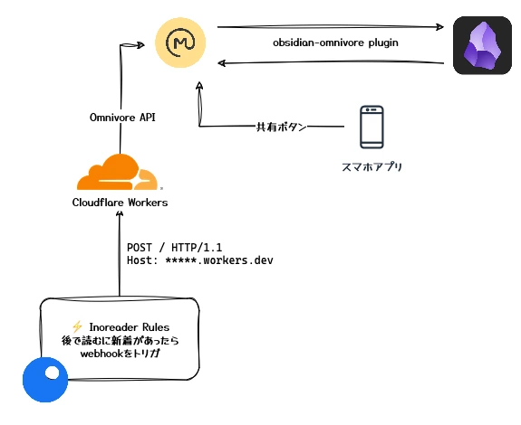
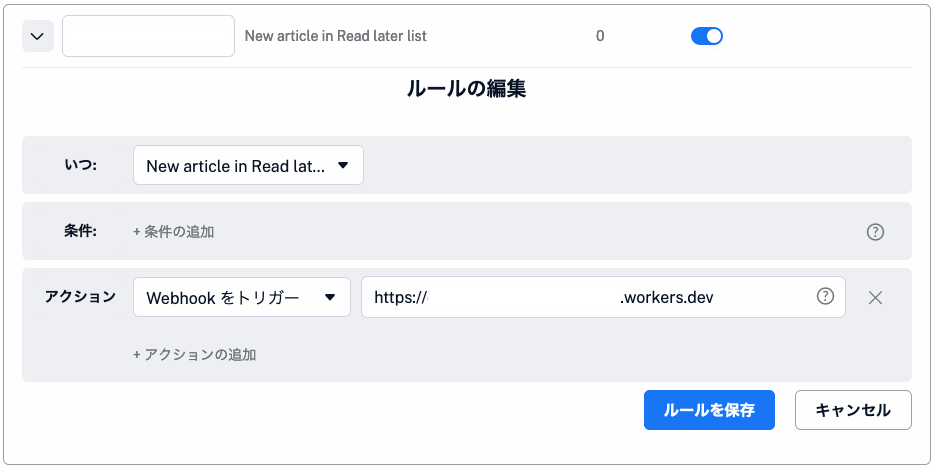

ウェブリソースのブックマークは[こんな感じのbookmarklet](https://gist.github.com/kepano/90c05f162c37cf730abb8ff027987ca3)を用意してブラウザからトリガしてObsidianに保存、というスタイルを取っていた。

プラグインに依存しなくてよいという点でそれなりに気に入っていたものの、次のような点が気になってきた。

- 当たり前だがブラウザが必須で、モバイルだと体験が悪い
  - 任意のアプリの「共有」ボタンからブクマ、とかできない
- Obsidianの起動を挟むので、スッとブクマできない
- Inoreaderと微妙に統合できておらず辛い（Proユーザー）

このあたりを解消できて既存のワークフローも抑えるなら、だいたいこんな要件かなというところが見えた。

1. 基本的にRSS取得・閲覧はInoreaderが優れている（と感じている）ので、Inoreaderを起点にしたい
1. Obsidianと保存した記事は同期させておきたい
1. Inoreader以外から記事を保存したい

で、色々考えた結果こんな構成になった。



Obsidianとうまく連携できるRead It Later系のツールということで、Omnivoreを一旦採用し、Inoreaderの自動化機能（たぶんPro限定の機能かも）からOmnivoreのAPIを叩く。というワークフローを想定していたが、Inoreaderの実装している機能（カスタムwebhookのようなもの）では次のような問題があった。

- リクエストヘッダを付けることができない
  - OmnivoreはAPIキーをヘッダに仕込む必要があるため、なんとかしなければいけない
- リクエストボディにUUIDも付けなければいけない

ということで、いい機会なのでCloudflare Workersを採用し、微妙に噛み合わない部分の橋渡しとして動いてもらうことにした。

## Obsidian ↔ Omnivore

Omnivoreは[Obsidian向けの公式プラグイン](https://github.com/omnivore-app/obsidian-omnivore)を用意しており、これさえ入れておけば簡単に同期できる。

プラグインの設定はフロントマターを整理する程度で、同期するために特にやることはない。

## Inoreader ↔ Omnivore

先に述べた通り、InoreaderとOmnivoreをスムーズに連携するためには（私の知る限りでは）1枚緩衝材を挟む必要があり、今回は[Cloudflare Workers](https://developers.cloudflare.com/workers/)を採用している。

とりあえず、必要なものを揃えておく。

- [Workersの公式ドキュメント](https://developers.cloudflare.com/workers/get-started/guide/)を見ながらプロジェクトを作る
- OmnivoreのAPIキーを発行しておく

### Inoreaderでカスタムwebhookを設定する

Read laterに新着記事が入ったらwebhookをトリガするように構成しておく。このときwebhook URLはWorkersのエンドポイントを指す。



Inoreaderのwebhookは宛先のURLに下記のようなJSONをPOSTリクエストする（使ってない部分はゴリッと割愛）。

```http
POST /path/to/webhook HTTP/1.1
x-inoreader-rule-name: <自動化ルール名>
x-inoreader-user-id: <送信元のユーザーID>
content-type: application/json

{
  "items": [
    {
      "canonical": [
        {
          "href": "記事のURL"
        }
      ]
    }
  ]
}
```

気休め程度だが、自動化ルール名はなんとなく推測されにくいものに設定した。  
（OmnivoreのAPIを四方八方からバカスカ叩かれると困る）

### InoreaderからJSONを受け取りOmnivoreにリクエストする

Workersの実装はこんな感じになった。

https://github.com/shiomiyan/omnivore-workers/blob/master/src/index.ts

Inoraderのwebhookを[webhook.site](https://webhook.site/)でいくらかテストしてみたところ、リクエストヘッダに`x-inoreader-rule-name`と`x-inoreader-user-id`が付与されていたので、Workers側でアクセス制御的に使うことにした。これらをOmnivoreのAPIキーと併せてWorkersのシークレットに設定しておく。

```plaintext
npx wrangler secret put INOREADER_RULE_NAME
npx wrangler secret put INOREADER_USER_ID
npx wrangler secret put OMNIVORE_API_KEY
```

また、Omnivore APIリクエスト時にはUUID（`clientRequestId`）が必要なので、UUIDを適当に生成してリクエストする。

Omnivore APIはGraphQLを採用しているが、わざわざGraphQLクライアントを使うほどではないよな...となっていたところ、WorkersのRuntime APIに[fetch APIが用意されていた](https://developers.cloudflare.com/workers/runtime-apis/fetch/)ので、これを使うことにした。

## おわり

この手のEdge Function（Serverless Function？）的なサービスを初めて使ったが、ちょっとしたことをサクッと解決できて体験が良かった。

APIを叩けるエンドポイントの割にガードが甘い気はしているが、せいぜい私のブックマークが爆発する程度の被害だと思うのでヨシ！をした。


## 余談

Omnivoreは記事保存用のGETエンドポイントを用意しているので、Inoreaderのカスタムシェアボタンを使っても似たようなことが実現できる。

> Omnivore's frontend also exposes a frontend endpoint at https://omnivore.app/api/save for saving to your library in the browser. This endpoint will use your browser cookie to authenticate. This is normally used for integrating with other readers, like Inoreader.
>
> https://docs.omnivore.app/integrations/api.html

ただこれだとOmnivoreとInoreaderで保存した記事を自動で同期することはできないので、採用を見送った（あとポップアップがウザいなど）。

## 追記

この記事を書いた翌日にOmnivoreが「[サ終すんで〜](https://blog.omnivore.app/p/details-on-omnivore-shutting-down)」と言い出したので、即Raindropに乗り換えることになった。アーメン。

[ObsidianのRaindropプラグイン](https://github.com/kaiiiz/obsidian-raindrop-highlights-plugin)（Community）はかなりできが良く、まぁ結果的に何なら体験が良くなりそうなのでとりあえず良いか。

それはそうとWorkersのプロジェクト名に"Omnivore"を入れてしまったので、いつか変えたいな...めんどくせぇ...
