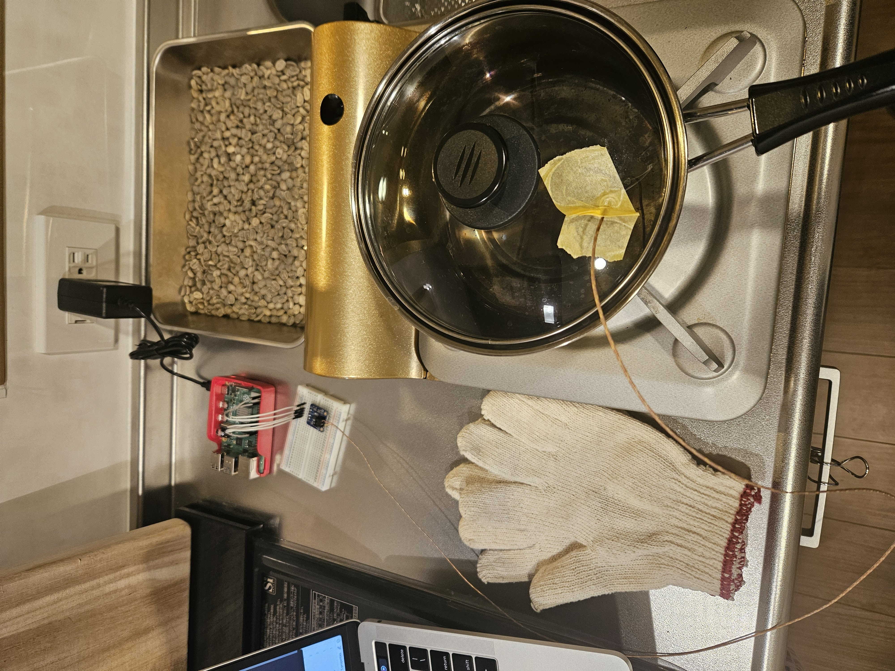
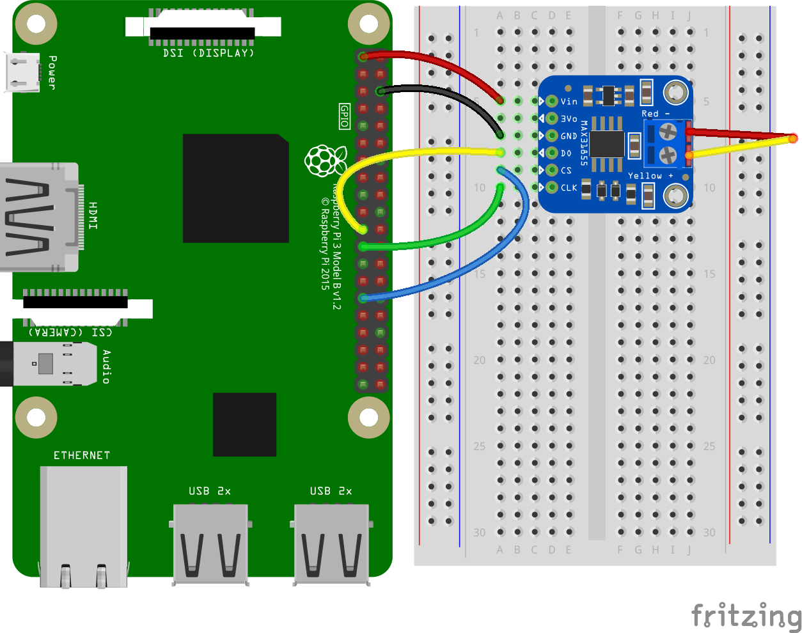
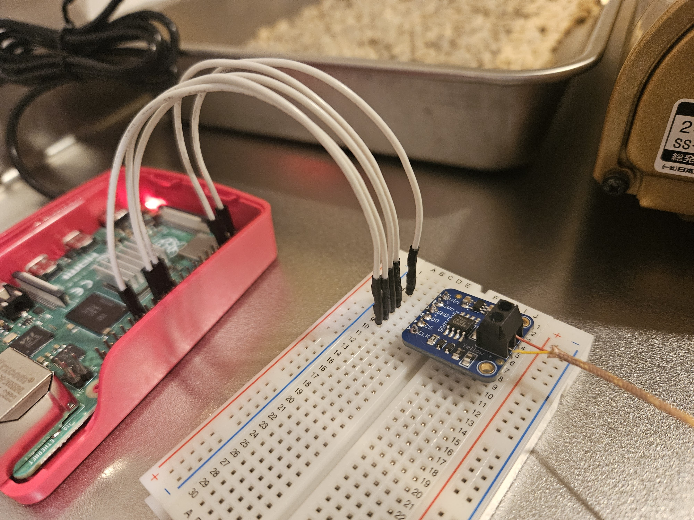
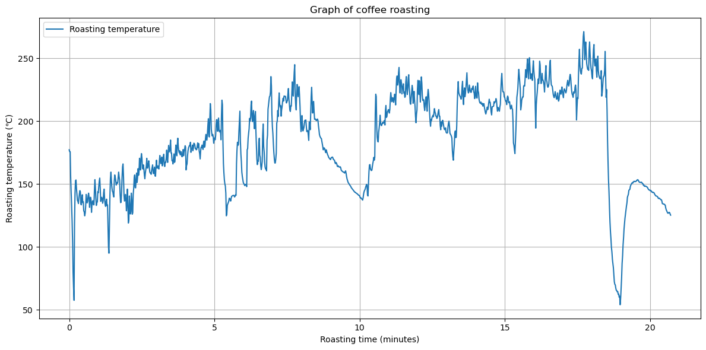

[Raspberry Pi Advent Calendar 2024](https://adventar.org/calendars/10003)の4日目の記事です。

コーヒー豆の手鍋焙煎にハマっており、安定した焙煎をするために（？）焙煎温度を計測したくなったので、やってみました。



といっても[CircuitPythonライブラリのチュートリアルみたいなドキュメント](https://learn.adafruit.com/circuitpython-on-raspberrypi-linux/spi-sensors-devices)をなぞっていくだけです。

## 準備したもの

- [Raspberry Pi 4 Model B (RAM 4G)](https://www.switch-science.com/products/6030)
    - オーバースペックでしかないですが、いつか役に立つと思って...
- ブレッドボード・ジャンパワイヤ
- [K型熱電対アンプモジュール（MAX31855）](https://akizukidenshi.com/catalog/g/g108218/)
- [K型熱電対プローブ](https://www.switch-science.com/products/2976)
- はんだ、はんだゴテ

一通り必要そうなものはスイッチサイエンスで揃えつつ、作業していて必要になったものは秋月電子へ買いに行きました（色々間違えて日に2度も秋月電子に足を運ぶことになりました）。

## ラズパイのセットアップ

SSH、SPI module、I2C moduleを有効化しておきます。

```shell
sudo raspi-config

# Interface Options -> SSH / SPI / I2C
```

## 色々繋ぐ

ラズパイのGPIOピンにブレッドボード経由で熱電対アンプモジュールを接続します。

[チュートリアルの配線図](https://learn.adafruit.com/circuitpython-on-raspberrypi-linux/spi-sensors-devices#wiring-2993466)通りに繋いでいくだけです。



というわけで、つなぎました。



## 計測する

MAX31855を利用するうえで必要なライブラリは`pip`で導入できますが、[グローバルインストールしようとすると怒られる](https://zenn.dev/tanny/articles/ce010edd69d56a)ので、仮想環境を使います。  
また、globalに入っているライブラリ（`board`とか）を仮想環境内から参照するために、`--system-site-package`オプションをつけます。

```shell
python -m venv .venv --system-site-package
source .venv/bin/activate
pip3 install adafruit-circuitpython-max31855
```

あとは引き続きチュートリアルに従うだけですが、後で温度変化を確認するためにCSVでそれらしいログを出力します。

```python
# SPDX-FileCopyrightText: 2021 ladyada for Adafruit Industries
# SPDX-License-Identifier: MIT

import time
import board
import digitalio
import adafruit_max31855


def main():
    spi = board.SPI()
    cs = digitalio.DigitalInOut(board.D5)
    max31855 = adafruit_max31855.MAX31855(spi, cs)

    start = time.time()
    data = []
    try:
        while True:
            try:
                tempC = max31855.temperature
            except RuntimeError:
                # Ignore `short circuit to ground` error 🔥
                pass
            else:
                now = time.time()
                data.append([now, tempC])
                print(f"Temperature: {tempC} C")
                print(
                    f"Elapsed: {int(now - start) // 60} min {int(now - start) % 60} sec"
                )
                time.sleep(1.0)

    except KeyboardInterrupt:
        import csv

        filename = f"data/roasting_{int(time.time())}.csv"
        with open(filename, mode="w", encoding="utf-8") as file:
            writer = csv.writer(file)
            writer.writerows(data)


if __name__ == "__main__":
    main()
```

何度かテストしていると`RuntimeError: short circuit to ground`が頻発するようになったので、握りつぶしました。  
デバイスにはあまり良くなさそうですが、人が死ぬわけではないので...。

## 結果をグラフに出力する

Jupyter環境を用意してグラフにします。Jupyterじゃなくてもいいのですが、必要なライブラリ群がサクッと揃って楽なので。

購入したRaspberry Piはメモリが4GBもあるので、arm64のOSを使えばDockerが普通に動きます。適当にcomposeファイルを用意してJupyter Notebookを立ち上げます。

```yaml
services:
  jupyter:
    image: quay.io/jupyter/scipy-notebook:2024-10-07
    ports:
      - 10000:10000
    command:
      - start-notebook.sh
      - --NotebookApp.token=''
      - --NotebookApp.disable_check_xsrf=True
    environment:
      - JUPYTER_PORT=10000
    volumes:
      - ./jupyter:/home/jovyan/work
      - ./data:/home/jovyan/data
```

で、よしなに可視化してみると、こんな感じでした。



10分付近にある温度変化は、カセットコンロのガスが切れてしまったことによるものです😢  
おかげで焙煎時間がめちゃめちゃ伸びてしまいました。

## 感想など

- 流石に固定方法が甘く（テープで蓋の穴に固定しているだけ）、計測ノイズが酷かった
  - 製品の信頼性みたいなところはわからないですが、[固定しやすそうな熱電対も売っている](https://www.amazon.co.jp/dp/B00FVREP12)ので、これを買って鍋に固定してもいいかもしれない
    - [こんな感じ](https://youtu.be/9vaDTce4eK4)
- [artisan](https://artisan-scope.org/)という焙煎専用のオープンソース可視化ツールがあるみたいなので、そっちを使うでも良かったかも（対応しているロガーに制限はあるっぽい）
- 普通に赤字
