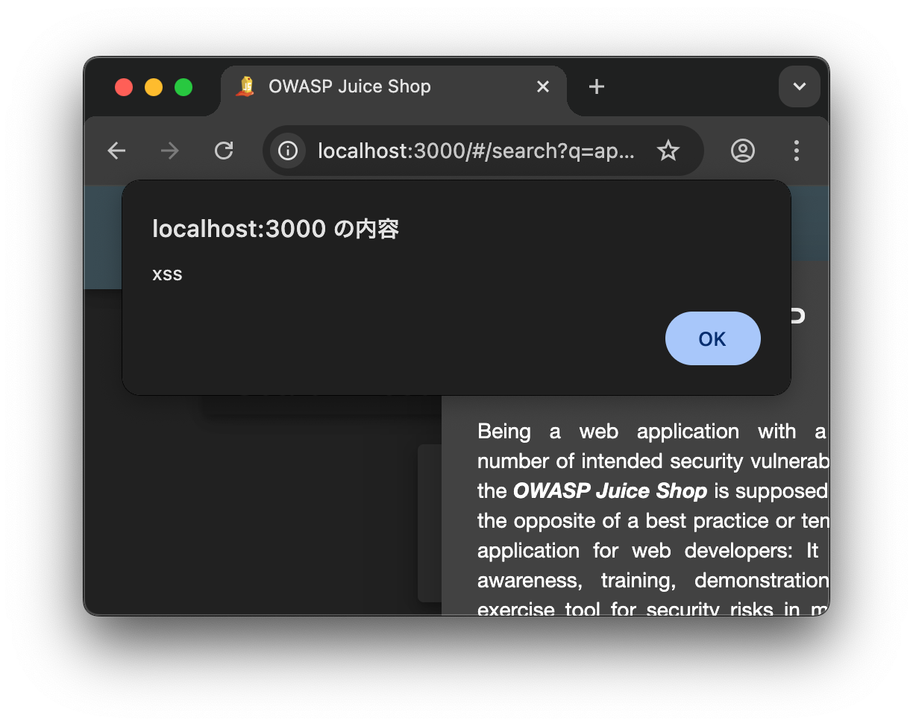

イマドキなWebアプリはクライアントでDOMを生成するケースが多い。
例えばXSSのペイロードをパラメータに入れたとして、`text/html`のレスポンスを見てもXSSが発火するかどうかの判断がつきにくく、結局ブラウザだとこうなるので、みたいな情報が欲しくなる。

Playwrightを触っていたところ、どうやらこの手のE2Eテストツールは「alert関数のようなダイアログにhookしてなにかする」みたいな機能を備えているらしい。「これを使えば検知できるんじゃないか！」となったので、JuiceShopあたりのDOM XSSを実験台にして雑に素振りしてみる。

調べてみると、同じようなアプローチをしているツールは普通にあるので、全く画期的な何かではない（まぁ、ですよね）。

- https://github.com/zaproxy/zap-extensions/blob/main/addOns/domxss/src/main/java/org/zaproxy/zap/extension/domxss/DomXssScanRule.java
- https://github.com/Asperis-Security/xssFuzz/blob/main/validate.py

## セットアップ

最近はDenoにお熱なので、なんとなくDenoで実装してみる（依存関係含めペライチで完結するのがいいですね）。

ブラウザ操作用のライブラリはPuppeteerを使う。Playwrightでも良かったけど、あとでChrome Recorderと組み合わせてみたかったので、そのあたりのサポートがよさそうなPuppeteerで。

事前にPuppeteerで使うブラウザをインストールする必要がある（たぶん）。

```shell
deno run --allow-all npm:puppeteer browsers install chrome
```

## alert関数にhookしてみる

さっそくalert関数が呼ばれたときになにかしてみる。

ブラウザコンテキスト周りのコードは https://zenn.dev/mizchi/articles/practical-await-using を参考にした。`await using`を使うとスコープから抜けるときに自動でリソース開放してくれる（リソース開放しないとブラウザが終了してくれない）。

実装はこれだけ。

```typescript
import * as puppeteer from "npm:puppeteer@23.10.1";

async function useBrowserContext() {
  const browser = await puppeteer.launch({ headless: false });
  const page = (await browser.pages())[0];

  page.on("dialog", (dialog) => {
    if (dialog.type() === "alert") console.log(dialog.message());
    dialog.dismiss();
  });

  return {
    browser,
    page,
    async [Symbol.asyncDispose]() {
      await browser.close();
    },
  };
}

if (import.meta.main) {
  const payload = encodeURIComponent("");
  await using ctx = await useBrowserContext();
  await ctx.page.goto("http://localhost:3000/#/search?q=apple" + payload, {
    waitUntil: "networkidle0",
  });
}
```

`console.log(dialog.message());`でalertされた文字がログされるようにしている。`deno run -A main.ts`で実行すると、ブラウザでalertが発火していることを確認できる。



コンソールに`xss`の文字が確認できたので、検知もできそう。おわり。
