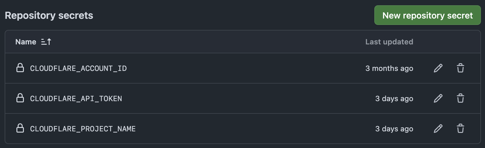

このブログのホスティング先を、GitHub PagesからCloudflare Pagesに移行したので作業ログをまとめておきます。

## Cloudflareにプロジェクトを作る

`wrangler`コマンドで作成できます。

```
npx wrangler pages project create

✔ Enter the name of your new project: … <CLOUDFLARE_PROJECT_NAME>
✔ Enter the production branch name: … master
✨ Successfully created the '<CLOUDFLARE_PROJECT_NAME>' project. It will be available at https://<CLOUDFLARE_PROJECT_NAME>.pages.dev/ once you create your first deployment.
To deploy a folder of assets, run 'wrangler pages deploy [directory]'.
```

あとで使うので、GitHubの"Repository secrets"に登録しておきます。variablesでも良さそうですが、なんとなくsecretsとして登録しました。

## 資格情報を取って回る

### Cloudflare Account ID

[CloudflareのDashboard](https://dash.cloudflare.com)から、"Compute (Workers) > Workers & Pages"に進み、右の方にある"Account ID"をコピーして、Repository secretsに登録します。

### Cloudflare User API Token

CloudflareのDashboardから、["👤アイコン > Profile > API Tokens"](https://dash.cloudflare.com/profile/api-tokens)に進み、Cloudflare PagesのEdit権限を持ったカスタムトークンを作成します。

作成したトークンはRepository secretsに登録します。

## GitHub Actionsで自動デプロイさせる

secretsは次のようになってます。



[cloudflare/wrangler-action](https://github.com/cloudflare/wrangler-action)を使ってデプロイします。Actionsのyamlは次のようになりました。

```yaml
...
jobs:
  deploy:
    runs-on: ubuntu-latest
    name: Deploy
    permissions:
      contents: read
      deployments: write
    steps:
      - name: Checkout repo using git
        uses: actions/checkout@v4

      - name: Build
        uses: actions/setup-node@v4
        with:
          node-version: '20'
      - run: npm ci
      - run: npm run build

      - name: Deploy
        uses: cloudflare/wrangler-action@v3
        with:
          apiToken: ${{ secrets.CLOUDFLARE_API_TOKEN }}
          accountId: ${{ secrets.CLOUDFLARE_ACCOUNT_ID }}
          command: pages deploy ./dist --project-name=${{ secrets.CLOUDFLARE_PROJECT_NAME }}
```

参考: https://github.com/cloudflare/wrangler-action?tab=readme-ov-file#deploy-your-pages-site-production--preview

## DNSを設定し直す

GitHub Pagesのカスタムドメイン設定を全部消して、再設定します。

```
type: CNAME
host: blog.736b.moe
answer: <CLOUDFLARE_PROJECT_NAME>.pages.dev.
```

## 終わり

GitHub Pagesにそれほど不満はありませんでしたが、なんとなくで移行してみました。

気持ちレスポンスが早くなったかも？
