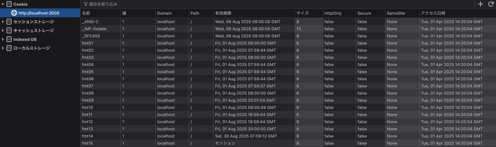
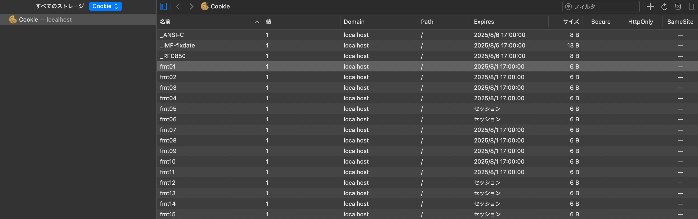
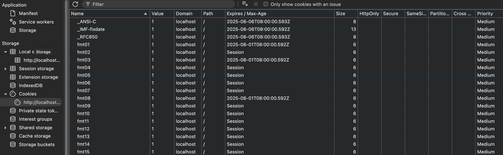

日々HTTPメッセージと格闘していると、まじでどうでも良さそうなことを調べたくなります。その備忘録です。

## HTTPで用いる日時書式

基本は[RFC 9110: section 5.6.7](https://www.rfc-editor.org/rfc/rfc9110.html#section-5.6.7)に書かれている、次の書式が最も一般的でしょう。

```plaintext
Sun, 06 Nov 1994 08:49:37 GMT    ; IMF-fixdate
Sunday, 06-Nov-94 08:49:37 GMT   ; obsolete RFC 850 format
Sun Nov  6 08:49:37 1994         ; ANSI C's asctime() format
```

これらはFirefoxでもChromeでもSafariでも、正しく日付を解釈できます。

問題はこれら以外の書式をどの程度解釈できるのか。確認も容易なのと、別に目的もあったので、CookieのExpires属性を使って検証を進めます。

## ブラウザの実態

ブラウザによって解釈は異なっています。一番寛容なのがFirefoxなのと、ソースコード中に例示されていたフォーマットが多かったので、これを参考に調査します。

Firefoxのソースコードを見るに、次のような日時書式はパース可能であると言われています。

> ```
> *   14 Apr 89 03:20:12
> *   14 Apr 89 03:20 GMT
> *   Fri, 17 Mar 89 4:01:33
> *   Fri, 17 Mar 89 4:01 GMT
> *   Mon Jan 16 16:12 PDT 1989
> *   Mon Jan 16 16:12 +0130 1989
> *   6 May 1992 16:41-JST (Wednesday)
> *   22-AUG-1993 10:59:12.82
> *   22-AUG-1993 10:59pm
> *   22-AUG-1993 12:59am
> *   22-AUG-1993 12:59 PM
> *   Friday, August 04, 1995 3:54 PM
> *   06/21/95 04:24:34 PM
> *   20/06/95 21:07
> *   95-06-08 19:32:48 EDT
> ```
>
> https://searchfox.org/mozilla-central/source/nsprpub/pr/src/misc/prtime.c#930-944
>
> （Chrumiumだと[このへん](https://source.chromium.org/chromium/chromium/src/+/main:net/cookies/cookie_util.cc;l=481)かな？）

PHPで適当なCookieを発行するページを作って検証します。検証日時は2025年4月1日なので、すべて未来の日付です。

```php
<?php
$cookies = [
    "fmt01=1; Expires=01 Aug 25 08:00:00",
    "fmt02=1; Expires=01 Aug 25 08:00 GMT",
    "fmt03=1; Expires=Fri, 01 Aug 25 8:00:00",
    "fmt04=1; Expires=Fri, 01 Aug 25 8:00 GMT",
    "fmt05=1; Expires=Fri Aug 01 08:00 GMT 2025",
    "fmt06=1; Expires=Fri Aug 01 08:00 +0000 2025",
    "fmt07=1; Expires=1 Aug 2025 08:00-GMT (Friday)",
    "fmt08=1; Expires=01-Aug-2025 08:00:00.00",
    "fmt09=1; Expires=01-Aug-2025 08:00pm",
    "fmt10=1; Expires=01-Aug-2025 08:00am",
    "fmt11=1; Expires=01-Aug-2025 08:00 PM",
    "fmt12=1; Expires=Friday, August 01, 2025 8:00 PM",
    "fmt13=1; Expires=08/01/25 08:00:00 PM",
    "fmt14=1; Expires=30/08/25 08:00",
    "fmt15=1; Expires=25-30-08 19:32:48 GMT",
    "_IMF-fixdate=1; Expires=Fri, 06 Aug 2025 08:00:00 GMT",
    "_RFC850=1; Expires=Friday, 06-Aug-25 08:00:00 GMT",
    "_ANSI-C=1; Expires=Fri Aug  6 08:00:00 2025"
];

foreach ($cookies as $cookie) {
    header("Set-Cookie: {$cookie}", false);
}

echo "test";
```

### Firefox 137



書式によってわずかに秒単位のズレが出ているのは気になりますが、おそらくすべて解釈できていそうです。

「おそらく」なのは、最後の`95-06-08 19:32:48 EDT`について未来の日時を設定できなかったためです。これどうやって年月日を判断するんだろう。

ちなみに、`20/06/95 21:07`（`fmt14`）あたりは設定できる日時に制限がありました。おそらく先頭が13以上の値でないとまともにパースできません。
また、Firefoxは日付のパースに失敗するとCookieをセットしません。

#### タイムゾーンの扱い

FirefoxではExpiresに示されたタイムゾーンを考慮して有効期限を設定します。

たとえば次のような場合、`IMF-fixdate-GMT`はそのままですが、`IMF-fixdate-JST`は9時間前の時間でCookieの有効期限が設定されます。

```http
Set-Cookie: IMF-fixdate-GMT=1; Expires=Fri, 06 Aug 2025 08:00:00 GMT
Set-Cookie: IMF-fixdate-JST=1; Expires=Fri, 06 Aug 2025 08:00:00 JST
```

### Safari 18.2



Safariもそれなりに寛容です。

パースできない場合、Session Cookieとして受け入れるようです。

### Chrome 134



最も日付書式が厳しく実装されています。

RFC 9110で言うところのIMF-fixdateとRFC 850 formatに近い形式ならパースできていそうな感じに見えます。

またSafariと同様、パースできない場合はSession Cookieとして受け入れるようです。

## まとめ

思ったよりもブラウザによって日時書式の解釈が異なることがわかりました。

誰得情報でした。

## おまけ: Puppeteerでブラウザの挙動をテストする

レスポンスをインターセプトすることで、上記のようなブラウザの挙動をテストできそうだったので、やりました。

```typescript
import * as puppeteer from "npm:puppeteer@24.5.0";

async function useBrowserContext() {
	const browser = await puppeteer.launch({
		browser: "firefox",
		headless: false,
	});
	const page = (await browser.pages())[0];

	await page.setRequestInterception(true);
	page.on("request", (request) => {
		if (request.url() === "http://dummy.localhost/") {
			request.respond({
				status: 200,
				headers: {
					"content-type": "text/html",
					"set-cookie": [
						"IMF-fixdate-GMT=1; Expires=Fri, 06 Aug 2025 08:00:00 GMT",
						"IMF-fixdate-JST=1; Expires=Fri, 06 Aug 2025 08:00:00 JST",
					],
				},
				body: "Expires datetime test",
			});
		} else {
			request.continue();
		}
	});

	return {
		browser,
		page,
		async [Symbol.asyncDispose]() {
			await browser.close();
		},
	};
}

if (import.meta.main) {
	await using ctx = await useBrowserContext();
	await ctx.page.goto("http://dummy.localhost/", {
		waitUntil: "networkidle0",
	});

	const cookies = await ctx.browser.cookies();
	for (const cookie of cookies) {
		console.log(cookie.name, new Date(cookie.expires * 1000));
	}
}

// ▶ deno run -A expires-datetime-test.deno.ts
// IMF-fixdate-GMT 2025-08-06T08:00:00.000Z
// IMF-fixdate-JST 2025-08-05T23:00:00.000Z
```

FirefoxでJSTからGMTに変換され、`IMF-fixdate-JST`では9時間前の日時が設定されることが確認できました。
