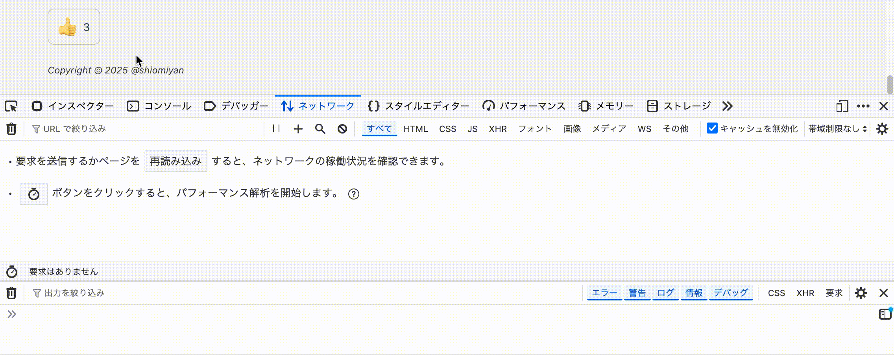

Cloudflareが分からん過ぎたので、N番煎じですがAstroで作った静的サイトにCloudflare Pages Functionsを使っていいねボタンを作ってみました。

全体的に雰囲気で書いてます。

## 前提

[私のブログ](https://blog.736b.moe/)はWranglerを使ってCloudflare Pagesにデプロイしています。なので、Functionsを実装するだけで大体済みました。

## Functionsにハローワールドする

記事ごとのいいね数をKVに記録するAPIを実装するために、Functionsを使います。

プロジェクトルートに`/functions`ディレクトリを作って、ポコポコTSファイルを書いていけばFunctionが作れます。  
概要については[Get started](https://developers.cloudflare.com/pages/functions/get-started/)を、TypeScriptプロジェクトでの始め方は[このあたり](https://developers.cloudflare.com/pages/functions/typescript/)を参考に進めました。

セットアップの中で`@cloudflare/workers-types`を使ったブログ記事が多い印象でしたが、`wrangler types`コマンドで型定義ファイルを作るのを推奨していそうな感じでした。

上記を参考に色々進めて、いったん次のようなディレクトリ構成です。いらなさそうなのは端折ってます。

```
.
├── functions
│  ├── hello-world.ts
│  ├── tsconfig.json
│  └── types.d.ts
├── public
│  └── <Astroのアセット>
├── src
│  └── <Astroのプロジェクトソースコード>
├── astro.config.mjs
├── package-lock.json
├── package.json
├── tsconfig.json
└── wrangler.toml

```

`hello-world.ts`は`/hello-world`にルーティングされます。ひとまず適当なレスポンスを返すように実装しました。

functions/hello-world.ts

```
export function onRequest(_context: any) {
  return new Response("Hello, world!")
}

```

ローカルで動作確認したいので、`wrangler pages dev`します。Functionsも立ち上がるはずです。  
私の場合、次のような感じでnpm scriptsを用意して、`npm run wrangler:dev`しました。

package.json

```
{
  ...
  "scripts": {
    "build": "npm run wrangler:types && astro check && astro build"
    "wrangler:types": "wrangler types --path ./functions/types.d.ts",
    "wrangler:dev": "npm run build && wrangler pages dev --local --live-reload ./dist",
    ...
  },
  ...
}

```

ちなみにこの書き方だと、Astro側のコードを変更したらサーバーを立て直さないといけないです。面倒ですが。（ワークアラウンドあるっぽいですが、そんなに困らなかったので）  
[AstroのCloudflareアダプタのドキュメント](https://docs.astro.build/en/guides/integrations-guide/cloudflare/#preview-with-wrangler)にも似たようなことが書いてあります。

ナニハトモアレFunctionsは使えるようになりました。

## 記事にULIDを採番する

記事といいね数を紐づけるために、各記事のフロントマターにULIDを採番しておきました。  
パス周りの情報を使ってもいいので必須じゃないですが、あとあと記事のパスとか変わったときに困りそうなので振っときました。

<https://github.com/shiomiyan/blog/blob/master/src/content/posts/java-tree-sitter/index.mdx#L5>

<https://github.com/shiomiyan/blog/blob/master/src/content/config.ts#L16>

## KVを作成する

`npx wrangler kv namespace create <好きに命名する>`でKVを作れます。実行すると「この設定を`wrangler.toml`に書いてね」と言ってくるので、追記しておきます。

多分こんな感じです。ローカルとProductionで使いたいので、トップレベルと`env.production`に書きました。

wrangler.toml

```
[[kv_namespaces]]
binding = "BLOG_736B_MOE_UPVOTE_COUNTER"
id = "dummy"

[[env.production.kv_namespaces]]
binding = "BLOG_736B_MOE_UPVOTE_COUNTER"
id = "dummy"

```

KV namespace IDがめっちゃ機微情報っぽいですが、ドキュメントを読む感じは公開情報として扱っていいだろうと解釈しています。

[https://developers.cloudflare.com/kv/concepts/kv-namespaces/#:\~:text=KV namespace IDs are public and bound to your account.](https://developers.cloudflare.com/kv/concepts/kv-namespaces/#:~:text=KV%20namespace%20IDs%20are%20public%20and%20bound%20to%20your%20account%2E)

namespacesはNon-inheritable keysにあたり、[トップレベルに書いても各環境に継承されないっぽい](https://developers.cloudflare.com/workers/wrangler/configuration/#non-inheritable-keys:~:text=Non%2Dinheritable%20keys%20are%20configurable%20at%20the%20top%2Dlevel%2C%20but%20cannot%20be%20inherited%20by%20environments%20and%20must%20be%20specified%20for%20each%20environment%2E)ので、各環境で個別設定が必要でした。

<https://developers.cloudflare.com/workers/wrangler/configuration/#kv-namespaces>

ローカル環境での実行において、Functions同様にKVも[特別な設定はいらなさそう](https://developers.cloudflare.com/workers/wrangler/configuration/#kv-namespaces)で、`wrangler pages dev`すればよさそうです。  
`wrangler pages dev`すると、KVを模倣するためのモロモロが`.wrangler/state/v3/kv`配下に出現します。

## FunctionsにAPIを実装する

あらかた準備できたので、`/functions`ディレクトリに実装します。次のような構成にしました。

```
 ./functions
+├── api
+│  ├── _middleware.ts
+│  └── upvote.ts
 ├── hello-world.ts
 ├── tsconfig.json
 └── types.d.ts

```

`upvote.ts`では、記事に設定されたULIDをキーに取得・インクリメントする処理がメインです。[変そうな処理](#%E4%B8%80%E5%BF%9C%E5%A4%89%E3%81%AA%E3%83%AA%E3%82%AF%E3%82%A8%E3%82%B9%E3%83%88%E3%81%AF%E3%83%90%E3%83%AA%E3%83%87%E3%83%BC%E3%82%B7%E3%83%A7%E3%83%B3%E3%81%99%E3%82%8B)が書かれていますが、いったんスルーしてください。

<https://github.com/shiomiyan/blog/blob/master/functions/api/upvote.ts>

ついでに、`_middleware.ts`で`/api`配下にCORSヘッダを設定しておきました。

<https://github.com/shiomiyan/blog/blob/master/functions/api/%5Fmiddleware.ts>

ヨシ！

### 一応変なリクエストはバリデーションする

好き放題KVに書き込まれると精神衛生上イマイチなので、`post_id`が既知のULIDではない場合は書き込ませないようにしたいです。  
既知の`post_id`をFunctionsへ配信するうまい方法が思いつかず、次のようないびつそうな形で実現しました。

- AstroのIntegration APIを使って、ビルド時にMDXのフロントマターからULIDを引っ張り出して`/dist/data/ulids.json`に書き出す
- FunctionsからHTTP経由で参照して検証する（`fetch("/data/ulids.json")`）

astro.config.mjs

```
export default defineConfig({
  // ...
-  integrations: [sitemap(), mdx(), pagefind()],
+  integrations: [sitemap(), mdx(), pagefind(), collectUlid()],
  // ...
})

```

<https://github.com/shiomiyan/blog/blob/master/src/integrations/collect-ulid.ts>

[このあたりの記事](https://alpacat.com/posts/astro-hooks/)を参考にしましたが、想定解では無い感がすごいです。いい方法があれば知りたいです。

## Astroでボタンを実装する

ボタンのコンポーネントを作って適当な場所に設置します。

<https://github.com/shiomiyan/blog/blob/master/src/components/Upvote.astro>

こだわりはないと言うかこだわる余地もなさそうなので、親切な同僚（ChatGPT）に実装してもらいました。

## できた

できました。



## おわり

おわりです。安定稼働を祈ります。
