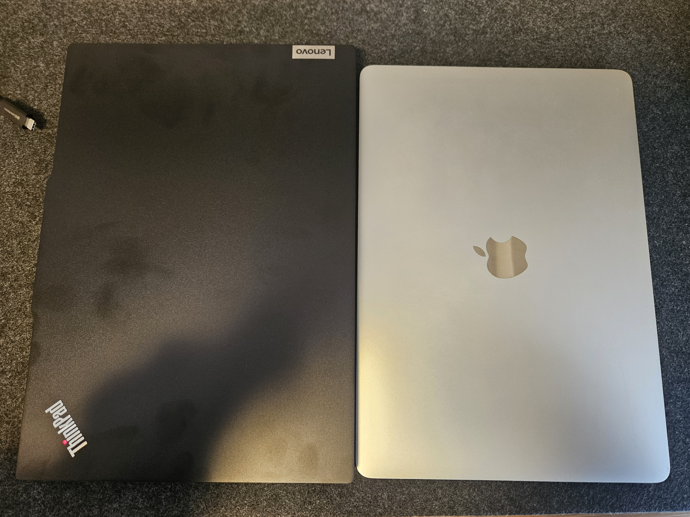
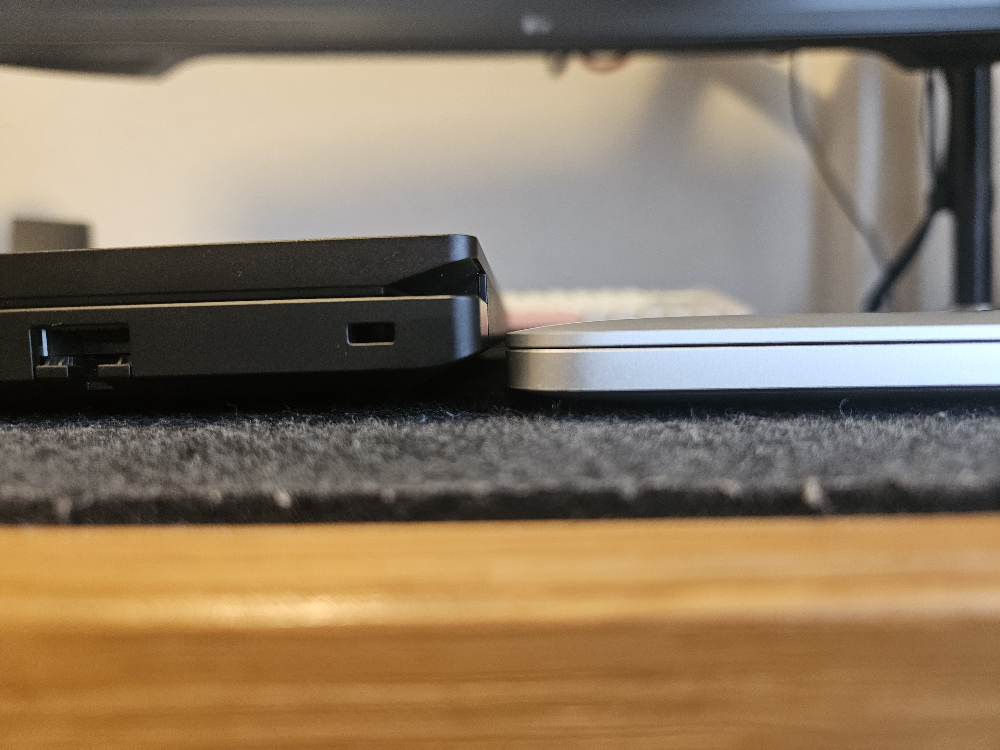
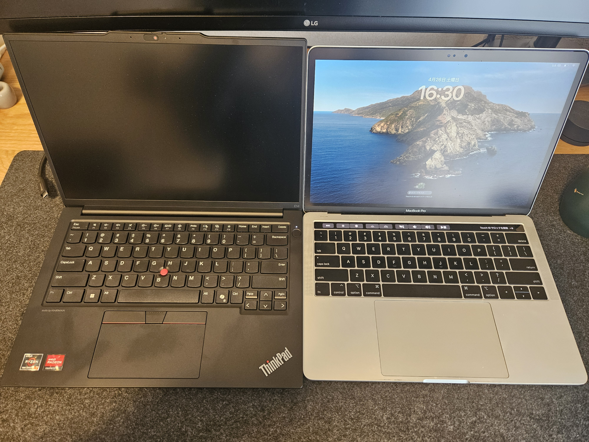
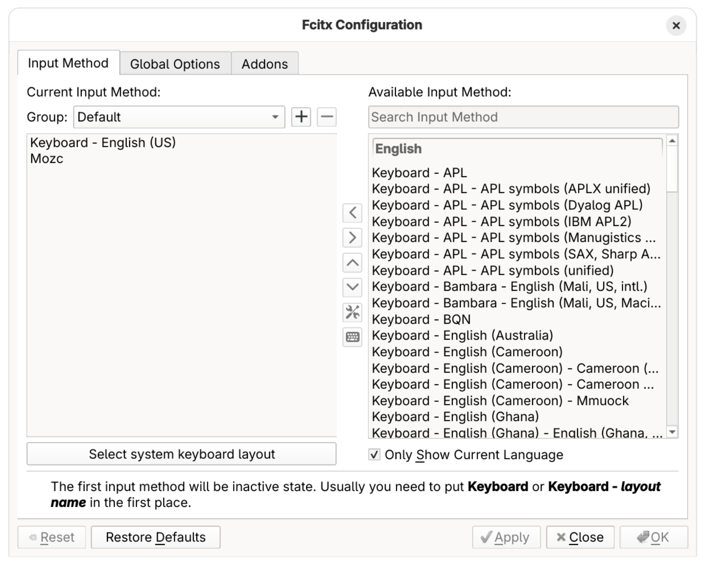
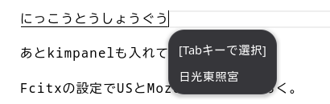

## TL;DR

- Thinkpad E14を買った
- Fedora 42をインストールし、目立ったトラブルもなく、快適に使えている


## 背景など

[学生時代に調達したMacBook Pro](https://support.apple.com/en-us/111945)を使い続けていたが、 スペック的に貧弱で、ブラウザフリーズなど発生しがちだった。

端末候補は以下の観点からほぼThinkpad一択で、[価格.com限定モデル](https://kakaku.com/item/K0001620677/)をカスタマイズしたものを注文した。

- US配列を選択可能である
- Linuxフレンドリーである
- 入力端子がそれなりにある
- 15万は超えたくない

価格.comのリンクに記載されている部分ではあるが、基本スペックは次の通り。

- CPU: AMD Ryzen 7 7735HS
- RAM: 32GB
- グラフィック: AMD Radeon 680M
- ストレージ: 1TB

CPUに関して、MacBook Proのそれと比較すると、[ベンチマーク](https://www.cpubenchmark.net/compare/3605vs5138/Intel-i5-8257U-vs-AMD-Ryzen-7-7735HS)を見る限り雲泥の差だ。

アップグレードしたものは次の通り。

- ディスプレイ: 2.2K液晶に変更した
- 指紋センサーを追加した
- キーボード: 英語配列に変更した
  - バックライト有無によってキーボードの質感が変わると聞いていたが、バックライトなしを選択した
  - バックライトありが良かったかもしれない
- バッテリー: 57Whに変更した


<details><summary>📷️ ギャラリー（主にMacBook Pro 2019との比較）</summary><div>

色の問題もありそうだが、指紋が目立ちやすい印象。横から見ると倍くらいの厚みがあり、実際重量もMacBook Proより100g程度重い。（公称値は1.44kg~となっている）







</div></details>


## 下準備

- Windows上で実施した作業
  - MicrosoftアカウントにWindowsライセンスを紐付ける
  - Bit Lockerによる暗号化を無効化する
  - Fedora Media WriterでブータブルUSBを作成する
- セキュアブートを無効化する

## Fedoraインストール

OSは[Fedora Workstation](https://fedoraproject.org/workstation/)を選択した。私見でしかないが、ちょうどいい塩梅で壊れにくい印象がある。

デュアルブートな環境ではなく、Linuxのみの環境にする。基本的に気をつけるポイントはないが、日本語で環境設定を進めるとホームディレクトリ直下に日本語でディレクトリが作成されてしまうため、すべて英語で進める。

[有志による互換ドキュメント](https://github.com/ramaureirac/thinkpad-e14-linux/tree/main/thinkpad-e14-gen6)があったので、大きな問題は起きないだろう、と踏んでいた。

## キー入力周り

後続の作業で確実に影響が出るので、最初にやる。

### ThinkpadのBIOS設定

ThinkpadのBIOS設定でFnとCtrlは入れ替えている。あと、Fn as Primaryみたいな（Fnキーがマルチメディアキーとならないようにする）やつも設定している。

### キーリマップ


key remapperは[evremap](https://github.com/wez/evremap)を使う。evremapはプリビルドバイナリを提供してくれていないので、自分でビルドしないといけない。

なので、まずはRustをインストールする。

https://www.rust-lang.org/learn/get-started

evremapはlibevdevに依存しているので、追加の依存関係をインストールし、ビルドする。

```
sudo dnf install libevdev-devel
cargo build --release
```

設定ファイル群はsystemdの`.service`ファイルと設定用のtomlファイルが必要だが、どちらもevremapのリポジトリで設定例を確認できる。
なので、難しいことは考えずにこれを踏襲して、ビルドしたバイナリと設定ファイルを配置する。

```
sudo cp target/release/evremap /usr/bin/evremap
sudo touch /etc/evremap.toml
```

evremap.tomlは次のように設定した。

```toml
device_name = "AT Translated Set 2 keyboard"

[[dual_role]]
input = "KEY_CAPSLOCK"
hold = ["KEY_LEFTCTRL"]
tap = ["KEY_ESC"]

[[remap]]
input = ["KEY_LEFTCTRL", "KEY_LEFTBRACE"]
output = ["KEY_ESC"]
```

<details><summary>⚙️ 設定詳細</summary><div>

- `CapsLock`単体押しは`Esc`にマップする
- `CapsLock`を修飾キーとして使うときは`Ctrl`として使う
- `Ctrl+[`はEscにマップする

</div></details>

今のところキーボード（入力デバイス）単位で設定する必要があるため、`device_name`を書き換えたconfigをもう1つ用意している。
私の場合はThinkpadのオンデバイスキーボードとKeychronキーボードを兼用しているので、`evremap.toml`と`evremap-keychron-k2.toml`を用意して、それぞれ別のサービスとして登録した。

https://github.com/shiomiyan/dotfiles/tree/6d1621cbe744c5466e2de9ac6c1c1794053cde7a/system/evremap

## タッチパッド・ポインティングデバイス周り

驚くことに、何も設定せずにすべて問題なく動作しているように見える。特にThinkpadのトラックポイントあたりはうまく動かんだろうなと想像していたので、さすがはLinux用のマニュアルを用意しているだけはあるなと思った。

Thinkpadの乳首に慣れようと思うので、Gnomeの設定からタッチパッドは無効にした。

## IME周り

IMフレームワークにこだわりはないが、CLIやデスクトップアプリでVimキーバインドを多用するので、Normalモードへ戻る際にIMEを無効化できると良い。（「っっっっｊ」避け）

私は上記のようなケースをNeovimの設定で[`fcitx5-remote`コマンドを呼び出して解決している](https://github.com/shiomiyan/dotfiles/blob/6d1621cbe744c5466e2de9ac6c1c1794053cde7a/config/nvim/init.lua#L356-L361)ため、例によってfcitx5に移行する。このタイミングでIMEもなんとなくmozcに移行する。

下記手順に従えば良い。

- https://fcitx-im.org/wiki/Install_Fcitx_5
- https://fcitx-im.org/wiki/Using_Fcitx_5_on_Wayland#GNOME

```
sudo dnf fcitx5 fcitx5-mozc
```

さらに[kimpanel for Gnome-Shell](https://extensions.gnome.org/extension/261/kimpanel/)もインストールする。

最後にIMEが自動起動するように設定し、デフォルトIMをfcitx5に変更する。はずだったのだが、どこかで勝手に変わったのか、自動起動設定だけしたら動くようになった。

```
mkdir -p ~/.config/autostart
ln -s /usr/share/applications/org.fcitx.Fcitx5.desktop ~/.config/autostart/
```

起動できたら、Fcitxの設定でUSとMozcを有効にしておく。



この時点で、問題なく変換できる状態になった。



ちなみに、Fedora 42はデフォルトでibus-anthyが使えた。特別な事情がない限りデフォルトのままキーボード設定を追加すれば日本語が打てるようになる。

## 開発環境周り

基本はdotfilesを持ってくるだけになる。bootstrapスクリプトは用意しているけどメンテしていないので、基本手動でセットアップする。

とは言っても、やることは適宜ツールをインストールして`$XDG_CONFIG_HOME`にシンボリックリンクを張っていくだけ。

この辺はやるだけなので詳細は割愛するが、なんとなく特記したいものは下記にまとめておく。

- [Cursor](https://www.cursor.com/ja/downloads)
  - AI支援なエディタとしてCursorを使いだしていたところだった
  - がしかし、Linux向けに提供されているAppImageとランタイムバージョン管理に使っている[mise](https://mise.jdx.dev/)との相性が悪く、AppImageから起動すると、miseが有効にならない
  - ワークアラウンドとしては`--appimage-extract`で展開後、展開されたフォルダ内のAppRunから起動すると解決する
  - （これを機にVSCodeの拡張機能ベースのAI支援に切り替えてもいいかなぁ、など）
- [Bitwarden SSH Agent](https://bitwarden.com/help/ssh-agent/)を導入してみた
  - Credentialを管理できるのは良い
  - gitが毎回unknown client扱いになってしまい、pushのたびに認可しないといけなくてうざい
  - Bitwardenがお漏らししたら本当に終わりだなぁ、とはなる

## おわりに

MacBook Proは5-6年くらい使ったので、今回もそのくらい使いたい所存です。
