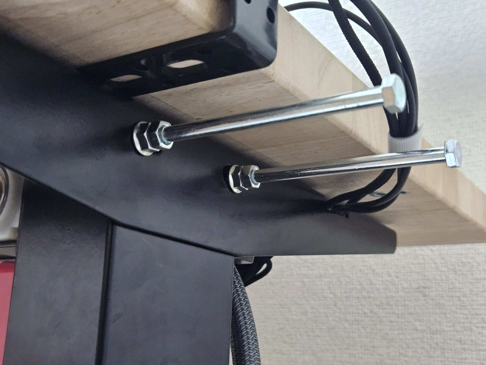
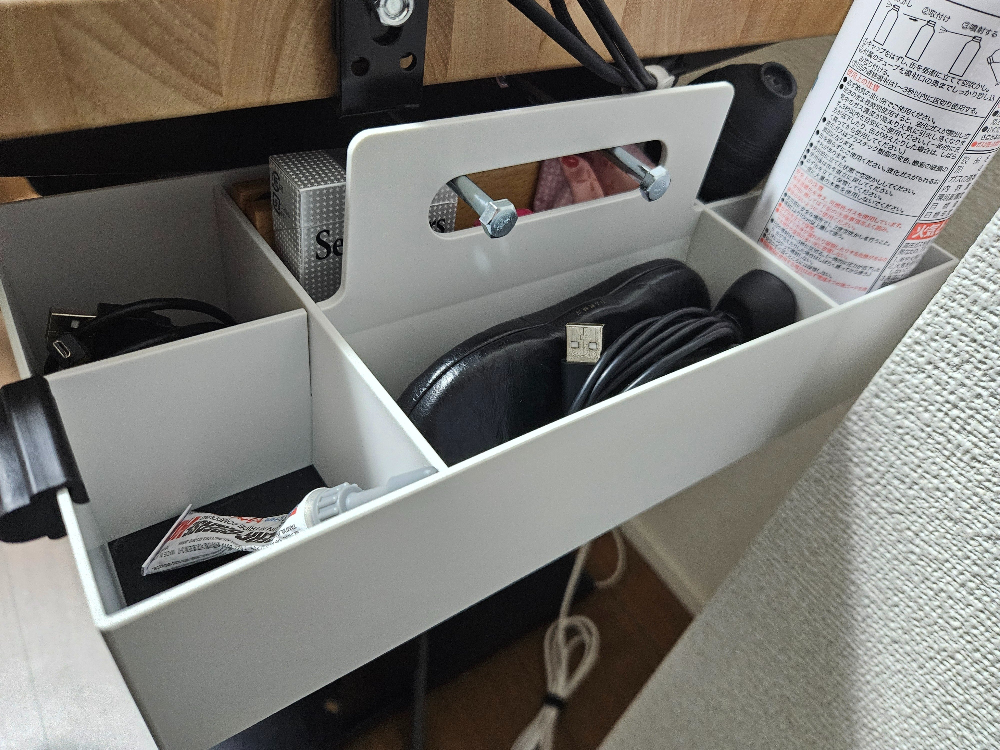
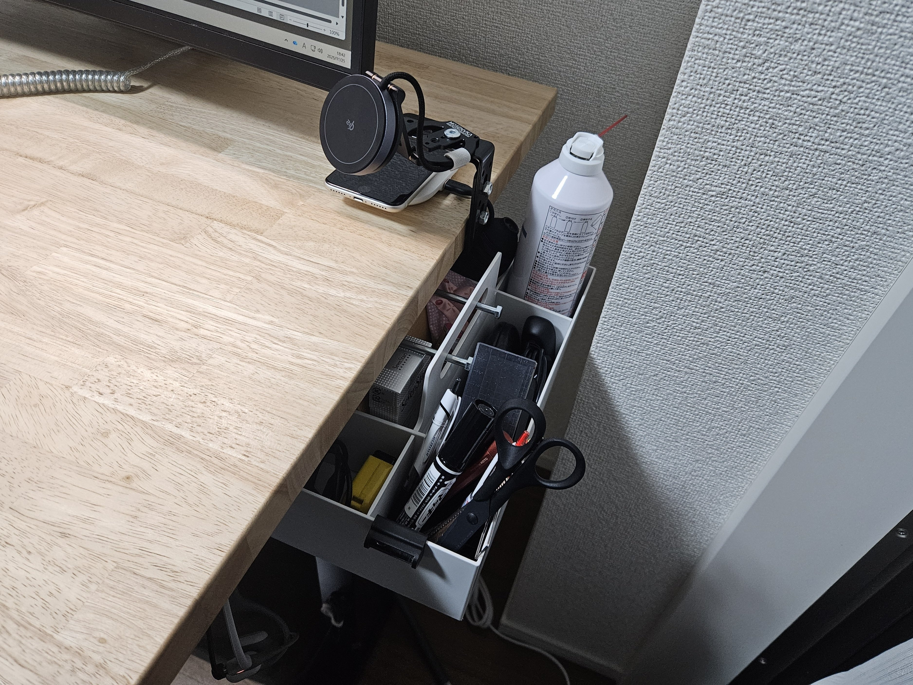

以前はIKEAのヴァッテンカールをぶら下げていたが、なんかやり過ぎ感というか、邪魔になってきた。  
なるべくスッキリと収納をするためのアイデアをメモしておく。  
なおデスク脚はFlexispot H1で、この脚のネジ穴を活用する形にはなっていますが、ほかのデスクでも上手くやれるところはありそう。な気がする。

使うものは下記。

- 11-12cmくらいのM6ネジ
  - 無印良品のキャリーボックスをぶら下げられるだけの長さで、よしなに。

- 無印良品 キャリーボックス
  - Vitraのツールボックスもいいけど、高いので…

特に難しいことはなく、脚固定用のネジを長いものにする。

デスクの脚から伸びたボルト。

これにキャリーボックスを引っ掛けるだけ。

ボルトにぶら下がっているキャリーボックス（1）。

ボルトにぶら下がっているキャリーボックス（2）。

今のところ落ちたりしていないので、しばらくこれで運用してみる。  
落下防止のための何かはあってもいいかも…？
