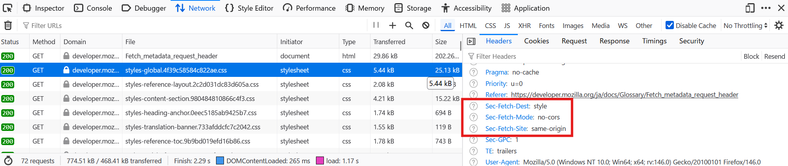

[東葛.dev Advent Calendar 2025](https://adventar.org/calendars/11653)、21日目の記事です。

（現在時刻: 2025年12月21日72時43分（:suimasen:））

すでにN番煎じとなりつつありますが、モダンなCSRF対策の話です。

## Fetch Metadata

[Fetch Metadataリクエストヘッダ](https://developer.mozilla.org/ja/docs/Glossary/Fetch_metadata_request_header)は、モダンブラウザで自動的に送出されるリクエストヘッダです。

ブラウザのDevToolsを見る機会があれば、なんかついてるな、くらいには思ったことがあるんじゃないでしょうか。



MDNにも記載がある通り、これらのヘッダはCSRFをはじめとするクロスサイトな攻撃の対策として活用できます。

Fetch Metadataリクエストヘッダはいくつか種類があり、おおよそ下記に記載のヘッダがよく目にするところかなと思います。

- `Sec-Fetch-Site`
- `Sec-Fetch-Mode`
- `Sec-Fetch-Dest`
- `Sec-Fetch-User`

ことCSRFの対策文脈では、基本的には`Sec-Fetch-Site`をメインに気にすることになってくるはず...です。  
（なお、以降で紹介するフレームワークの中には、`Sec-Fetch-Site`以外もクロスサイトリクエスト判定に活用しているものがあります）

## `Sec-Fetch-Site`

`Sec-Fetch-Site`は、リクエストがどこから送出されたものか、を抽象化したデータを持ちます。

下記のいずれかの値をとります。（補足はそのままな感じですが）

- `Sec-Fetch-Site: same-origin`
  - 同一オリジン（スキーム、ホスト、ポート番号が同じ）
- `Sec-Fetch-Site: same-site`
  - ウェブ文脈での"サイト"（`a.site.example`と`b.site.example`は同じ"サイト"、のやつ）
- `Sec-Fetch-Site: cross-site`
  - サイトが異なる（`site.example`と`other-site.example`は別の"サイト"）
- `Sec-Fetch-Site: none`
  - 直接遷移（アドレスバーからとか、ブックマークからとか）

CSRF上記の通り、これらの値をもとに

## CSRF対策

CSRF攻撃は正規サイト以外（クロスサイト）からリクエストを成立させることができてしまう点が問題です。

当該リクエストがどこから発生したリクエストか判別できれば良いので、先述の`Sec-Fetch-Site`ヘッダをもとに、リクエストの出自を検証することで、CSRF攻撃を対策できます。

OWASP CheatSheet Seriesから引用しつつ、具体的な例としてクロスサイトを弾きたい場合（同一サイト、同一オリジンはOK）であれば、下記のようにします。

```js
const SAFE = new Set(['GET','HEAD','OPTIONS']);
const site = req.get('Sec-Fetch-Site'); // e.g. 'cross-site','same-site','same-origin','none'

if (site === 'cross-site' && !SAFE.has(req.method)) {
  return false; // forbid this request
}
```

https://cheatsheetseries.owasp.org/cheatsheets/Cross-Site_Request_Forgery_Prevention_Cheat_Sheet.html#fetch-metadata-headers

`Origin`ヘッダの検証と似たような話ですが、URL parseしなくてもよい点がよさそうです（小並感）。

## フレームワーク動向

下記フレームワークでは、Fetch Metadataリクエストヘッダを検証するような実装がありそうです。

- [Go 1.25](https://go.dev/doc/go1.25#nethttppkgnethttp)
  - [Go1.25 リリース連載 net/http - CSRF対策](https://future-architect.github.io/articles/20250804a/)
- [Struts 6.0.0](https://struts.apache.org/security/#resource-isolation-using-fetch-metadata)
- [Hono - CSRF Protection](https://hono.dev/docs/middleware/builtin/csrf)
- Rails 8.2?
  - [Rails8.2ではCSRFトークンを使わずにCSRFを防げるようになりそう](https://blog.willnet.in/entry/2025/12/15/192245)

とはいえ、フレームワークともなればOriginへのフォールバックを合わせて実装しているケースがほとんどでしょう。（`same-origin`以外は弾く、みたいな過激派にならない限りは、自前実装においてもフォールバックしておくのが無難だとは思います）（ちゃんと読んでないですが...）

## 余談

OWASP CheatSheet SeriesのIssueでは「Fetch MetadataリクエストヘッダがCSRFトークンを置き換えるか？」について結構盛り上がってました。

https://github.com/OWASP/CheatSheetSeries/issues/1803

結果的に下記文言が残っているところを見るに

>It is important to note that Fetch Metadata headers should be implemented as an additional layer defense in depth concept. This attribute should not replace a CSRF tokens (or equivalent framework protections).

OWASP見解としては置き換えられない判断だったように見えますね？個人的にはCSRFトークンいらんだろ、と思いますが、道はまだ長そう。
