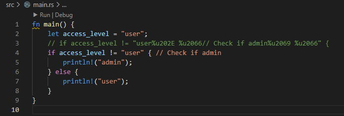
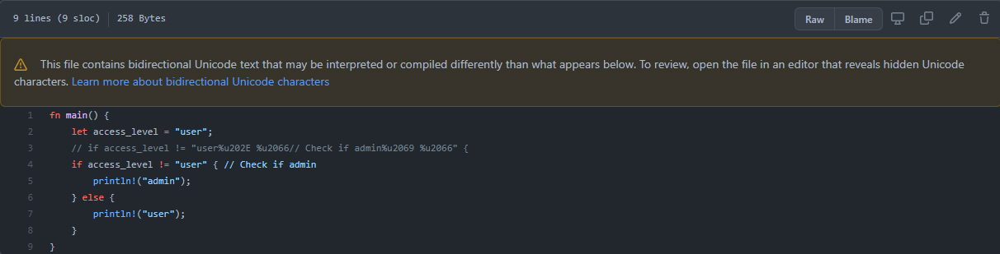

「書くこと」をしたかったのでまとめてみます。

元記事は以下です。

https://blog.rust-lang.org/2021/11/01/cve-2021-42574.html

## CVE-2021-42574

Rust の脆弱性というわけではなく、その他のプログラミング言語（C、Java、JavaScript、Python、Go など）でも同様に起こりうるものです。"bidirectional override"（双方向オーバーライド...？）の Unicode コードポイントを含むソースコードで発生する可能性があります。

例えば、日本語や英語は左から右への言語ですが、アラビア語などは右から左への言語です。こうした読む方向が異なる言語間の問題を解決するために、Unicode は目には見えないコードポイント（双方向オーバーライド）を持っているそうです。

この攻撃手法は「Trojan Source」と呼ばれていて、Unicode の方向性を示す目に見えない文字を悪用し、コードを改ざんできます。その結果、人間が目視で解釈するコードのロジックと、実際にコンパイルされるコードのロジックを異なるものにするものです。

## 何が起こるか

Rust のブログのコードを拝借して、実際に VSCode 辺りで開いてみます。



3 行目のコメントアウトの Unicode 文字をでコードし、そのまま書いたのが 4 行目です。目視では `access_level` と `"user"` を比較しているだけに見えます。しかし実際は `"user%u202E %u2066// Check if admin%u2069 %u2066"` と比較しています。

rustc 1.56 ではこのコードは問題なくコンパイルされ、`admin` が出力されます。

最新バージョンの rustc 1.56.1 では、以下のようにコンパイルエラーとなります。

```
error: unicode codepoint changing visible direction of text present in literal
 --> src\main.rs:4:24
  |
4 |     if access_level != "user // Check if admin " {
  |                        ^^^^^--^^^^^^^^^^^^^^^^--
  |                        |    ||                ||
  |                        |    ||                |'\u{2066}'
  |                        |    ||                '\u{2069}'
  |                        |    |'\u{2066}'
  |                        |    '\u{202e}'
  |                        this literal contains invisible unicode text flow control codepoints
  |
  = note: `#[deny(text_direction_codepoint_in_literal)]` on by default
  = note: these kind of unicode codepoints change the way text flows on applications that support them, but can cause confusion becausse they change the order of characters on the screen
  = help: if their presence wasn't intentional, you can remove them
help: if you want to keep them but make them visible in your source code, you can escape them
  |
4 |     if access_level != "user\u{202e} \u{2066}// Check if admin\u{2069} \u{2066}" {
  |                             ~~~~~~~~ ~~~~~~~~                 ~~~~~~~~ ~~~~~~~~
```

https://github.com/shiomiyan/CVE-2021-42574

## おわりに

OSS の優良なコントリビューターを装って不正なロジックを混入させるといった攻撃に使われるんでしょうか。

Rust はだいぶ軽快にアップデートをしたようですが、他がどうかは未調査です。

## おまけ

GitHub 上でも警告が出るようになってました。



## 参考

- https://blog.rust-lang.org/2021/11/01/cve-2021-42574.html
- https://github.blog/changelog/2021-10-31-warning-about-bidirectional-unicode-text/
- https://www.bleepingcomputer.com/news/security/trojan-source-attack-method-can-hide-bugs-into-open-source-code/
